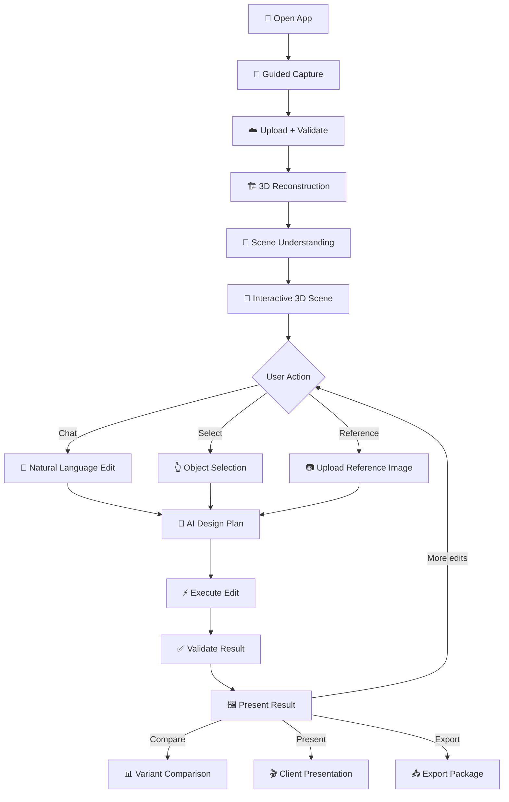
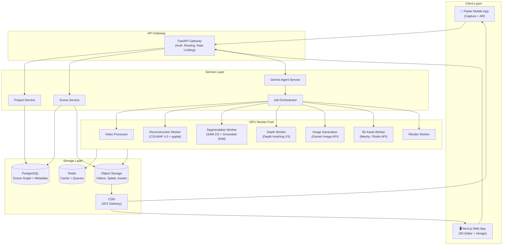
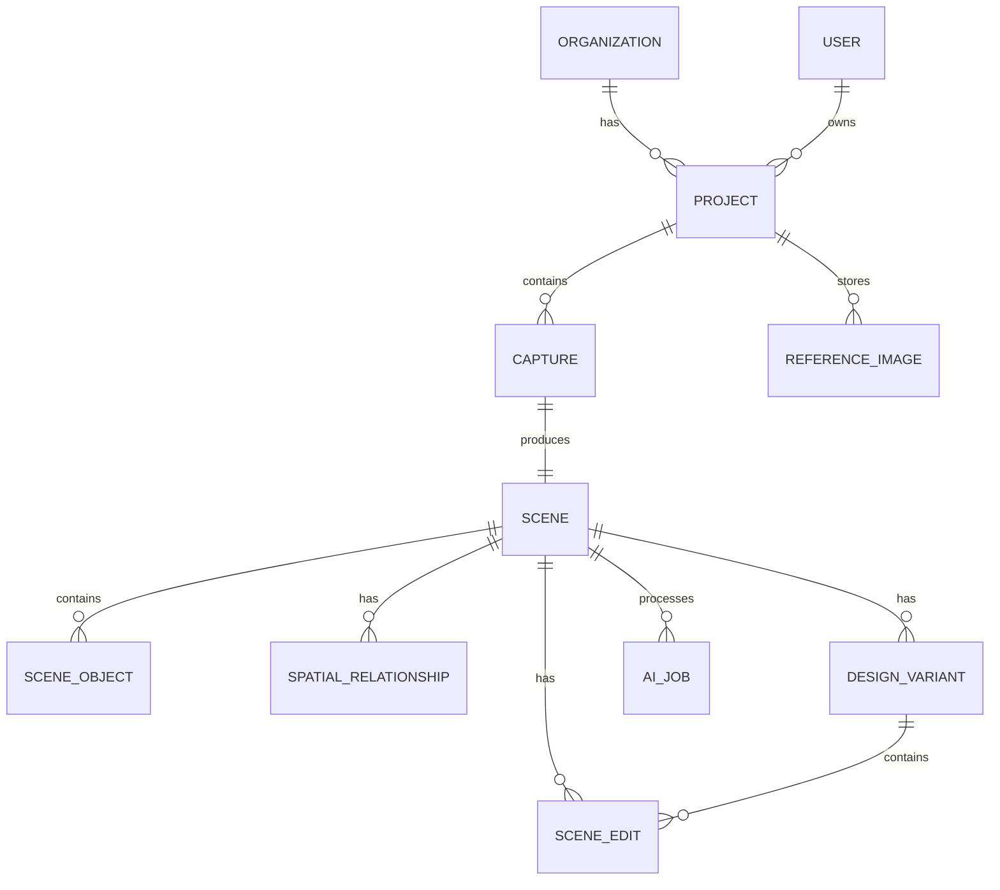
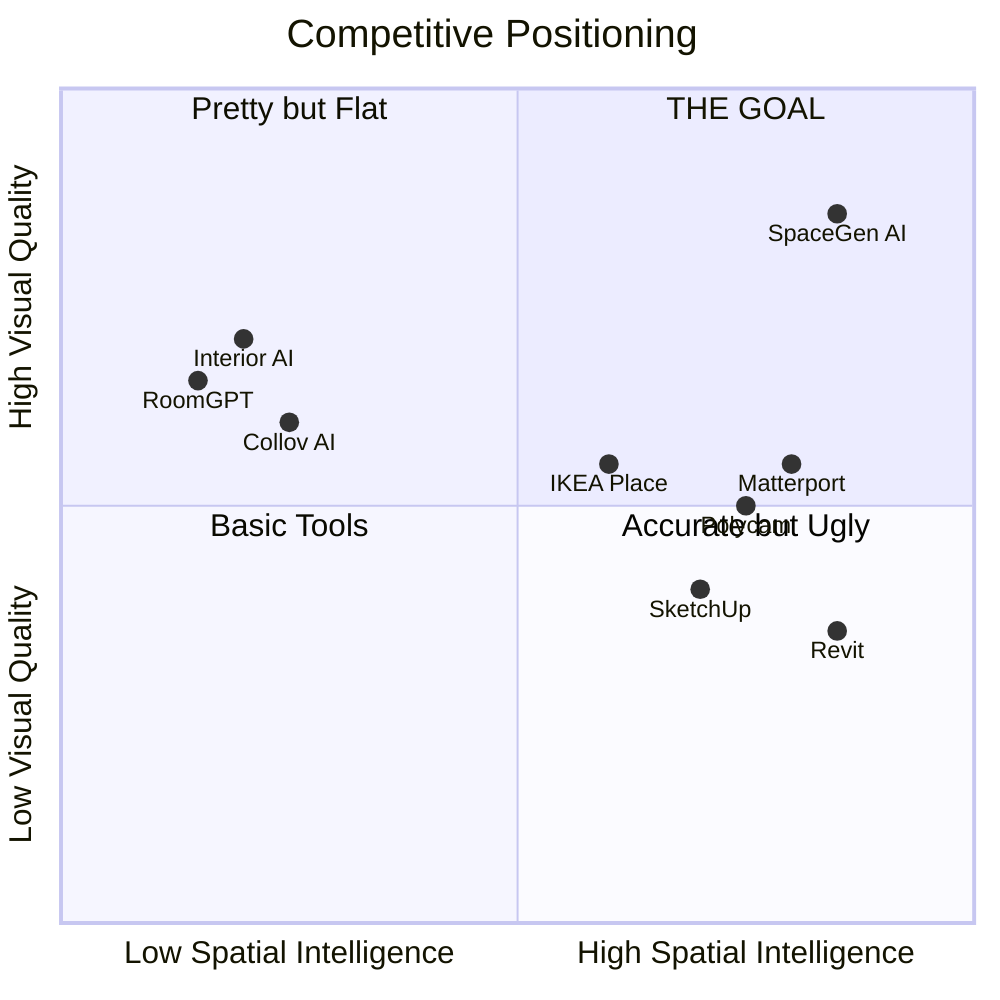

# SPACEGEN AI — Master Technical & Product Plan

**Version 1.0 — August 2026**
**Classification: COMPREHENSIVE ENGINEERING PLAN**

> **The AI-native spatial design platform that turns real physical environments into persistent, conversationally editable digital twins.**

---

## 1. Executive Summary

SpaceGen AI is a spatial design operating system for architects and interior designers. The user captures a physical room with a phone, the system reconstructs a persistent 3D digital twin using Gaussian Splatting, Gemini reasons over a semantic scene graph, and the user edits the space through natural language and reference images — with every edit spatially anchored across all viewpoints.

### Core Technical Stack (Verified August 2026)
| Layer | Technology | Status |
|-------|-----------|--------|
| 3D Reconstruction | 3D Gaussian Splatting via gsplat/Nerfstudio | **VERIFIED — industry standard** |
| SfM / Poses | COLMAP 4.0 (with integrated GLOMAP) | **VERIFIED — GPU-accelerated** |
| Scene Intelligence | Gemini 3.7 Flash + 3.5 Pro | **VERIFIED — function calling, structured output** |
| Image Generation | gemini-3.1-flash-image / gemini-3-pro-image | **VERIFIED — native generate_content()** |
| Segmentation | SAM 2/3 + Grounded SAM 2 | **VERIFIED — video-consistent** |
| Depth | Depth Anything V3 | **VERIFIED — metric + multi-view** |
| Web Viewer | Three.js r186+ (native GaussianSplatMesh) | **VERIFIED — WebGPU + SPZ** |
| Frontend | Next.js + React Three Fiber | **VERIFIED — production-ready** |
| Mobile | Flutter (Impeller engine) | **RECOMMENDED — best 3D perf** |
| AR | ARKit RoomPlan + ARCore Depth API | **VERIFIED — native splat rendering** |
| Object 3D | Meshy / Rodin API | **VERIFIED — PBR mesh output** |

### What This Is NOT
- ❌ An image-to-image style transfer tool (that's RoomGPT)
- ❌ A chatbot that generates pretty room pictures
- ❌ A Gaussian Splat viewer with no intelligence
- ❌ A CAD/BIM system

### What This IS
- ✅ A persistent 3D spatial canvas
- ✅ With Gemini as the design intelligence layer
- ✅ Enabling conversational editing of real physical environments
- ✅ Preserving spatial consistency across viewpoints
- ✅ Connecting design vision to purchasable products

---

## 2. Product Vision

> **Figma for physical spaces.**

The reconstructed 3D environment is the canvas. Gemini is the design intelligence. Gaussian Splats are the visual source of truth. The semantic scene graph is the structural source of truth. Generative AI is the creative layer — not the geometric engine.

**The core loop:**

```
Capture → Reconstruct → Understand → Select → Ask → Generate → Validate → Explore → Compare → Present
```

**The critical differentiator:** When a user says "replace the sofa," the system doesn't just generate a new image. It identifies the sofa in 3D space, segments it from the scene, places a new 3D asset at the correct position/scale/orientation, harmonizes lighting and materials, and ensures the result is spatially persistent when the camera moves to any viewpoint.

**North Star Metric:** Time from phone capture to first client-presentable redesign < 15 minutes.

---

## 3. Target Customer + Initial Wedge

### Analysis

| Segment | Pain Severity | Willingness to Pay | Frequency | Competition | Verdict |
|---------|--------------|-------------------|-----------|-------------|---------|
| Interior Designers | 🔴 Extreme | 💰💰💰 High | Daily | Medium (tools are manual) | **PRIMARY** |
| Architects | 🟠 High | 💰💰💰 High | Weekly | High (Revit/SketchUp) | **PRIMARY** |
| Real Estate (Virtual Staging) | 🟡 Medium | 💰💰 Medium | Per-listing | High (commoditized) | SECONDARY |
| Furniture Retailers | 🟡 Medium | 💰💰 Medium | Campaign-based | Medium (IKEA Place etc.) | SECONDARY |
| Homeowners | 🟢 Low-Medium | 💰 Low | Rare | Very High | TERTIARY |

### Decision: **Interior Designers First**

**Why:**
1. **Extreme workflow pain**: Today they manually model rooms in SketchUp/3ds Max (4-8 hours per room) or use 2D mood boards that don't communicate spatial reality
2. **High willingness to pay**: Already paying $50-200/mo for Enscape, V-Ray, SketchUp Pro
3. **Daily usage**: Active projects require constant visualization
4. **Word-of-mouth network**: Designers share tools with peers aggressively
5. **Clear value metric**: "This saved me 6 hours per client presentation"

**Initial wedge workflow:**
> Designer visits client site → captures room (3 min) → gets 3D scene (15 min) → generates 3 design concepts with Gemini (5 min) → presents to client on tablet (immediate)

**The gap no one fills:** Polycam captures spaces but doesn't redesign. RoomGPT redesigns but doesn't understand space. SketchUp understands space but requires manual modeling. SpaceGen AI does all three.

---

## 4. Core User Journey



### Step-by-Step Detail

**STEP 1 — CAPTURE (2-5 minutes)**
- User opens mobile app
- Guided AR overlay shows coverage map in real-time
- System uses IMU + visual SLAM for live tracking
- Real-time quality indicators:

```
Spatial Coverage       █████████░ 90%
Frame Sharpness        ██████████ 98%
Camera Motion          ████████░░ 82%
Lighting Stability     ███████░░░ 74%
Geometry Confidence    ████████░░ 86%
```

- Adaptive guidance: "Walk closer to the window" / "Slow down" / "Tilt camera up slightly"
- On LiDAR devices: simultaneous depth capture via ARKit/RoomPlan

**STEP 2 — UPLOAD + PROCESS (10-20 minutes)**
- Resumable upload via tus protocol
- Background processing with live progress updates via SSE
- User can close app and return when ready

**STEP 3 — EXPLORE (immediate once ready)**
- 3D Gaussian Splat viewer in browser
- Orbit, pan, zoom, first-person walkthrough
- Object highlights on hover (from segmentation)
- Scene graph panel shows detected objects

**STEP 4 — EDIT (seconds per edit)**
- Natural language: "Replace the sofa with something modern"
- Direct selection: click object → action menu
- Reference image: upload photo → "Use this sofa here"

**STEP 5 — PRESENT**
- Before/after slider
- Variant gallery (3 concepts side by side)
- Client presentation mode (full-screen, no UI chrome)
- Export: images, walkthrough video, shareable web link

---

## 5. Product Feature Hierarchy

### P0 — Must Ship (MVP)
- [ ] Guided video capture (mobile)
- [ ] Video → 3DGS reconstruction pipeline
- [ ] Web-based 3D splat viewer
- [ ] Gemini scene understanding (room type, objects, materials)
- [ ] Natural language chat interface for edits
- [ ] Object segmentation + selection
- [ ] Gemini image generation for hero-frame edits
- [ ] Reference image upload + understanding
- [ ] Before/after comparison
- [ ] 3 design variant generation
- [ ] Basic project management (save/load)

### P1 — Fast Follow (Month 2-3 post-MVP)
- [ ] 3D asset placement (from Meshy/Rodin)
- [ ] Material/texture editing
- [ ] Multi-view consistent editing
- [ ] Camera bookmarks
- [ ] Floor plan generation
- [ ] Client presentation mode
- [ ] Shareable web viewer links
- [ ] Export: high-res images, PDF presentation

### P2 — Growth (Month 4-6)
- [ ] AR preview (native iOS/Android)
- [ ] Product catalog integration
- [ ] Measurement tools (estimated)
- [ ] Walkthrough video rendering
- [ ] Team collaboration (comments, sharing)
- [ ] Design history + undo/redo
- [ ] Material board generation

### P3 — Platform (Month 7-12)
- [ ] LiDAR-calibrated measurements
- [ ] BIM/CAD export (IFC, USD)
- [ ] Multi-room capture
- [ ] Product commerce integration
- [ ] Enterprise SSO + team management
- [ ] API for third-party integrations
- [ ] Vision Pro / Quest support

---

## 6. System Architecture



### Key Architectural Decisions

1. **Separation of intelligence and geometry**: Gemini NEVER directly manipulates 3D data. It reasons, plans, and calls tools.
2. **GPU workers are stateless**: Jobs are queued in Redis, processed by GPU workers, results stored in object storage.
3. **Scene graph is the source of truth**: PostgreSQL stores the semantic scene graph; object storage holds the binary assets (splats, meshes, textures).
4. **Progressive delivery**: SPZ-compressed splats streamed via CDN for instant web loading.

---

## 7. End-to-End Data Pipeline

```
PHONE VIDEO (H.264/HEVC, 1080p-4K)
    ↓
UPLOAD (tus resumable, chunked)
    ↓
VIDEO VALIDATION
    ├── Format check (FFmpeg probe)
    ├── Duration check (30s - 5min)
    ├── Resolution check (min 1080p)
    └── Basic quality score
    ↓
FRAME EXTRACTION (FFmpeg)
    ├── Extract at source FPS (typically 30fps)
    ├── Motion blur detection (gradient variance)
    ├── Exposure normalization
    └── Rolling shutter correction (if needed)
    ↓
KEYFRAME SELECTION
    ├── Adaptive geometric filtering
    ├── Overlap scoring (feature matching)
    ├── Baseline distance optimization
    ├── IMU-guided selection (if available)
    └── Target: 100-500 keyframes from 2-5min video
    ↓
CAMERA POSE ESTIMATION (COLMAP 4.0)
    ├── Feature extraction (SuperPoint or SIFT)
    ├── Feature matching (LightGlue or exhaustive)
    ├── GLOMAP global mapper (fast)
    ├── Bundle adjustment (Caspar GPU-accelerated)
    ├── Fallback: DUSt3R/MASt3R for difficult cases
    └── Output: camera intrinsics + extrinsics per frame
    ↓
DEPTH ESTIMATION (Depth Anything V3)
    ├── Per-frame metric depth maps
    ├── Multi-view consistency check
    └── Scale alignment with SfM
    ↓
3D GAUSSIAN SPLATTING (gsplat via Nerfstudio)
    ├── Point cloud initialization from SfM
    ├── Gaussian optimization (5-15 min on A10)
    ├── Adaptive density control
    ├── SPZ compression for web delivery
    └── Output: .ply + .spz files
    ↓
SEMANTIC SEGMENTATION
    ├── SAM 2/3 instance segmentation on keyframes
    ├── Grounded SAM 2 for text-prompted detection
    ├── Gaussian Grouping / LangSplat for 3D labels
    ├── Consistency across frames
    └── Output: per-Gaussian semantic labels
    ↓
SCENE UNDERSTANDING (Gemini 3.7 Flash)
    ├── Room classification
    ├── Object categorization
    ├── Material identification
    ├── Style analysis
    ├── Spatial relationship extraction
    └── Output: semantic scene graph (JSON)
    ↓
SCENE GRAPH ASSEMBLY
    ├── Merge 3D segmentation + Gemini understanding
    ├── Compute bounding boxes
    ├── Estimate object dimensions
    ├── Build spatial relationships
    └── Store in PostgreSQL
```

### Minimum Capture Requirements

| Parameter | Minimum | Recommended | Why |
|-----------|---------|-------------|-----|
| Resolution | 1080p | 4K | More pixels → better reconstruction |
| FPS | 24 | 30 | Sufficient overlap between frames |
| Duration | 30 seconds | 2-3 minutes | Full room coverage |
| Max Duration | 5 minutes | 3 minutes | Diminishing returns; processing cost |
| Camera Motion | Slow walk | Steady orbit | Prevents motion blur; good baselines |
| Overlap | 60% | 80% | COLMAP needs feature correspondence |
| Lighting | Even ambient | Consistent natural | Avoids exposure shifts |

### Handling Difficult Conditions

| Condition | Detection | Mitigation |
|-----------|-----------|------------|
| Motion blur | Gradient variance < threshold | Drop frame, request re-capture |
| Low texture (white walls) | Feature count < 50/frame | DUSt3R fallback for poses; depth prior |
| Mirrors/Glass | Reflection detection via depth inconsistency | Mask reflective regions; mark as low-confidence |
| Moving people/pets | SAM 2 tracking + temporal consistency | Mask dynamic objects; inpaint background |
| Changing lighting | Exposure histogram variance | Normalize; warn user |
| Fast motion | IMU acceleration spike | Drop frames; request slower capture |
| Large rooms | Coverage gap detection | Guide user to uncovered areas |

---

## 8. 3D Reconstruction Comparison

| Criterion | 3D Gaussian Splatting | NeRF (Nerfacto) | COLMAP + MVS Mesh | LiDAR (RoomPlan) |
|-----------|----------------------|-----------------|-------------------|-----------------|
| **Visual Realism** | ⭐⭐⭐⭐⭐ Photorealistic | ⭐⭐⭐⭐ Good | ⭐⭐⭐ Textured mesh | ⭐⭐ Parametric |
| **Reconstruction Speed** | 5-15 min (GPU) | 15-30 min | 10-30 min | 60-90 sec (on-device) |
| **Geometry Quality** | ⭐⭐⭐ Good (SuGaR extraction) | ⭐⭐⭐ Implicit | ⭐⭐⭐⭐ Explicit mesh | ⭐⭐⭐⭐⭐ Metric |
| **Editability** | ⭐⭐⭐⭐ Object-level via segmentation | ⭐⭐ Difficult | ⭐⭐⭐ Mesh editing | ⭐⭐⭐⭐⭐ Parametric |
| **Semantic Understanding** | ⭐⭐⭐⭐ LangSplat/Gaussian Grouping | ⭐⭐ LERF | ⭐⭐ Separate step | ⭐⭐⭐⭐ Built-in |
| **Multi-view Consistency** | ⭐⭐⭐⭐⭐ Native | ⭐⭐⭐⭐⭐ Native | ⭐⭐⭐⭐ Good | ⭐⭐⭐⭐ Good |
| **Web Rendering** | ⭐⭐⭐⭐⭐ Native Three.js | ⭐ Requires server | ⭐⭐⭐⭐ Standard | ⭐⭐⭐ USD viewer |
| **Mobile Rendering** | ⭐⭐⭐⭐ WebGPU + SPZ | ⭐ Not feasible | ⭐⭐⭐⭐ Standard | ⭐⭐⭐⭐ Native |
| **AR Compatibility** | ⭐⭐⭐⭐ RealityKit native | ⭐ None | ⭐⭐⭐⭐ GLB/USDZ | ⭐⭐⭐⭐⭐ Native |
| **GPU Requirements** | 12-24GB VRAM training | 8-16GB | 4-8GB | None (on-device) |
| **Cost per Scene** | ~$0.50-2.00 (cloud GPU) | ~$1.00-4.00 | ~$0.30-1.00 | Free (device) |
| **Development Complexity** | Medium (gsplat mature) | Medium | High (pipeline) | Low (Apple API) |
| **Long-term Defensibility** | ⭐⭐⭐⭐ High (own pipeline) | ⭐⭐ Declining | ⭐⭐⭐ Commodity | ⭐ Apple-locked |

---

## 9. Final Reconstruction Recommendation

### Winner: **Option E — Hybrid Architecture**

```
ARCHITECTURE LAYER (Static)
    → 3D Gaussian Splatting (visual fidelity + web rendering)
    + LiDAR/RoomPlan geometry (when available, for metric accuracy)

OBJECT LAYER (Editable)
    → Segmented Gaussian groups (visualization)
    + Separate 3D mesh assets (for placed/replaced objects)

MATERIAL LAYER
    → Gemini-driven PBR material estimation
    + Generative texture maps

INTELLIGENCE LAYER
    → Semantic Scene Graph (PostgreSQL)
    + Gemini reasoning

VISUALIZATION LAYER
    → Gemini native image generation (hero frames)
    + 3D rendered composites (multi-view)
```

### Why This Architecture Wins

1. **3DGS gives us the best visual fidelity** for the base scene with native web rendering (Three.js r186+)
2. **Segmented Gaussians allow object-level interaction** without destroying the scene
3. **Separate 3D assets for replaced objects** ensure spatial persistence across viewpoints — we don't rely on generative consistency
4. **Gemini image generation for hero frames** gives photorealistic previews that sell the vision
5. **The scene graph** decouples intelligence from geometry — Gemini reasons over semantics, not raw splat data

### Critical Insight: Why Pure Image Generation Fails

> **RESEARCH-LEVEL PROBLEM**: Generating a beautiful edited image of a room does NOT produce a valid 3D edit. If you generate "a new cream sofa" in one view, rotating the camera will show the original sofa from a different angle. Multi-view generation (generating N consistent views and re-splatting) remains unreliable — view inconsistency corrupts geometry, creates ghosting, and hallucinates structure.

**Our MVP workaround:** Use hero-frame generation for immediate visual impact + 3D asset placement for spatial persistence. The user sees the beautiful generated image AND can rotate to verify the 3D asset is correctly placed. Over time, we improve the visual fidelity of the 3D compositing to match the generated image quality.

---

## 10. Scene Representation Strategy

### The Three-Layer Model

```
┌─────────────────────────────────────────────┐
│  LAYER 3: GENERATIVE VISUALIZATION          │
│  Gemini image generation for hero frames    │
│  Photorealistic previews per viewpoint      │
│  NOT the source of truth                    │
├─────────────────────────────────────────────┤
│  LAYER 2: EDITABLE OBJECT ASSETS            │
│  3D meshes (GLB) for replaced/added objects │
│  Positioned via scene graph coordinates     │
│  Renderable in 3D viewer + AR               │
├─────────────────────────────────────────────┤
│  LAYER 1: BASE SCENE (IMMUTABLE)            │
│  3D Gaussian Splat of original capture      │
│  Architecture, walls, floors, windows       │
│  The spatial ground truth                   │
└─────────────────────────────────────────────┘
```

**Layer 1** is reconstructed once and never modified (except for object removal via inpainting). It establishes the spatial coordinate system.

**Layer 2** contains all editable elements. When a user replaces a sofa, the original sofa Gaussians are hidden/removed, and a new 3D mesh is composited at the correct position. This mesh persists across all camera angles.

**Layer 3** is on-demand rendering for presentation quality. When the user wants a photorealistic hero shot, Gemini generates an image conditioned on the 3D scene state — camera pose, object positions, materials, lighting.

---

## 11. Semantic Scene Graph

### Schema

```json
{
  "scene": {
    "id": "scene_abc123",
    "project_id": "proj_xyz",
    "room_type": "living_room",
    "style": "modern_minimalist",
    "dimensions": {
      "width_m": 5.2,
      "length_m": 6.8,
      "height_m": 2.9,
      "confidence": "estimated",
      "source": "visual_reconstruction"
    },
    "lighting": {
      "primary_source": "natural_north_window",
      "color_temperature_k": 5500,
      "ambient_level": "bright"
    },
    "entities": [
      {
        "id": "wall_01",
        "type": "architecture",
        "category": "wall",
        "position": {"x": 0, "y": 0, "z": 0},
        "dimensions": {"width_m": 5.2, "height_m": 2.9},
        "material": {"type": "paint", "color": "warm_white", "finish": "matte"},
        "editable": false,
        "confidence": 0.95,
        "gaussian_ids": [1024, 1025, "..."],
        "source_frames": [1, 5, 12, 18, 24]
      },
      {
        "id": "sofa_01",
        "type": "furniture",
        "category": "sofa",
        "subcategory": "3_seater_sectional",
        "position": {"x": 2.1, "y": 0.0, "z": 3.4},
        "rotation": {"y": 180},
        "dimensions": {"width_m": 2.4, "depth_m": 0.95, "height_m": 0.85},
        "bounding_box": {"min": [0.9, 0, 2.9], "max": [3.3, 0.85, 3.85]},
        "material": {"type": "fabric", "color": "gray", "texture": "linen"},
        "style": "modern",
        "editable": true,
        "confidence": 0.96,
        "gaussian_ids": [2048, 2049, "..."],
        "source_frames": [3, 7, 14, 22],
        "edit_history": [],
        "replaced_by": null,
        "replacement_asset": null
      }
    ],
    "spatial_relationships": [
      {"subject": "sofa_01", "relation": "facing", "object": "tv_01"},
      {"subject": "coffee_table_01", "relation": "in_front_of", "object": "sofa_01"},
      {"subject": "sofa_01", "relation": "against", "object": "wall_02"},
      {"subject": "lamp_01", "relation": "next_to", "object": "sofa_01"}
    ]
  }
}
```

### Scene Graph Hierarchy

```
PROJECT
└── PROPERTY
    └── FLOOR
        └── ROOM (living_room)
            ├── ARCHITECTURE
            │   ├── wall_01 (north, warm_white paint)
            │   ├── wall_02 (east, warm_white paint)
            │   ├── wall_03 (south, warm_white paint)
            │   ├── wall_04 (west, warm_white paint)
            │   ├── floor_01 (marble tile, cream)
            │   ├── ceiling_01 (white, flat)
            │   ├── window_01 (north wall, 1.8m × 1.5m)
            │   └── door_01 (south wall, 0.9m × 2.1m)
            ├── FURNITURE
            │   ├── sofa_01 (3-seater, gray linen)
            │   ├── coffee_table_01 (glass + metal)
            │   ├── tv_unit_01 (walnut veneer)
            │   └── bookshelf_01 (oak, 5-tier)
            ├── LIGHTING
            │   ├── ceiling_light_01 (pendant, warm)
            │   └── floor_lamp_01 (arc, brass)
            ├── DECOR
            │   ├── plant_01 (monstera, ceramic pot)
            │   ├── cushion_01 (mustard, velvet)
            │   └── rug_01 (geometric, gray/white)
            └── SPATIAL_METADATA
                ├── relationships[]
                ├── measurements{}
                └── lighting_analysis{}
```

---

## 12. Gemini Architecture

### Model Selection

```env
GEMINI_REASONING_MODEL=gemini-3.5-pro          # Complex design reasoning, multi-step planning
GEMINI_FAST_MODEL=gemini-3.7-flash              # Intent parsing, quick scene queries, chat
GEMINI_IMAGE_MODEL=gemini-3-pro-image           # High-quality hero renders
GEMINI_IMAGE_FAST_MODEL=gemini-3.1-flash-image  # Quick previews, iterative edits
GEMINI_LITE_MODEL=gemini-3.5-flash-lite         # Validation, classification, subagent tasks
```

### What Gemini Does vs. Does NOT Do

| ✅ Gemini Does | ❌ Gemini Does NOT |
|---|---|
| Understand user intent | Directly manipulate 3D geometry |
| Analyze scene semantics | Run reconstruction pipelines |
| Generate design recommendations | Compute camera poses |
| Produce structured edit plans | Perform segmentation |
| Generate photorealistic images | Render 3D views |
| Understand reference images | Place objects in 3D space |
| Explain design decisions | Manage scene graph state |
| Validate edit results visually | Run physics simulations |

### Tool-Calling Architecture

```python
# Gemini Tool Definitions
tools = [
    # Scene queries
    Tool("get_scene", "Returns the full semantic scene graph"),
    Tool("get_room", "Returns room metadata: type, dimensions, style"),
    Tool("get_object", "Returns details of a specific scene object by ID"),
    Tool("get_measurements", "Returns estimated room measurements"),
    Tool("get_camera_poses", "Returns available camera viewpoints"),

    # Scene manipulation
    Tool("select_object", "Marks an object as the current selection target"),
    Tool("segment_object", "Triggers SAM-based segmentation of an object"),
    Tool("remove_object", "Hides/removes object Gaussians from the scene"),
    Tool("place_asset", "Places a 3D asset at specified position/rotation/scale"),
    Tool("move_object", "Moves an object to new coordinates"),
    Tool("scale_object", "Resizes an object by scale factor"),
    Tool("replace_material", "Changes material properties of an object"),

    # Generation
    Tool("generate_hero_image", "Generates photorealistic edited view via Gemini Image"),
    Tool("generate_3d_asset", "Generates a 3D mesh from description or reference image"),
    Tool("search_catalog", "Searches product catalog for matching real products"),
    Tool("generate_variants", "Creates N design variant proposals"),

    # Validation
    Tool("render_view", "Renders current 3D scene from a camera pose"),
    Tool("compare_views", "Compares original vs edited views for consistency"),
    Tool("validate_edit", "Checks edit for spatial consistency violations"),

    # Presentation
    Tool("create_variant", "Saves current scene state as a named variant"),
    Tool("export_scene", "Exports scene in specified format"),
]
```

### Orchestration Flow

```
USER INPUT: "Replace the sofa with something more luxurious"
    ↓
GEMINI 3.7 FLASH (Intent Parsing)
    ↓
    Intent: REPLACE_OBJECT
    Target: sofa_01 (confidence: 0.98)
    Style: "luxury" → {material: "velvet/leather", form: "curved/tufted", price_tier: "premium"}
    Constraints: {preserve_architecture: true, preserve_floor: true}
    ↓
GEMINI 3.5 PRO (Design Reasoning)
    ↓
    Tool Calls:
    1. get_object("sofa_01") → current sofa details
    2. get_measurements() → room dimensions
    3. get_room() → style context
    ↓
    Design Plan:
    - Remove gray linen 3-seater
    - Replace with curved cream velvet sofa
    - Dimensions: ~2.2m × 0.9m × 0.8m (fits space)
    - Position: same as sofa_01
    - Style alignment: elevates current modern base
    ↓
    Tool Calls:
    4. segment_object("sofa_01") → isolate sofa Gaussians
    5. generate_3d_asset({category: "sofa", style: "modern luxury curved", material: "cream velvet"})
    6. remove_object("sofa_01") → hide original
    7. place_asset(asset_id, position, rotation, scale)
    8. generate_hero_image(camera_pose_1, scene_state) → photorealistic preview
    9. validate_edit(original_view, edited_view) → check consistency
    ↓
RESULT → User sees before/after + 3D scene with new sofa
```

---

## 13. Image Generation Architecture

### Verified Capabilities (August 2026)

> [!IMPORTANT]
> **Imagen 4 endpoints were retired August 17, 2026.** Image generation is now native to Gemini models via `generate_content()`.

**Models:**
- `gemini-3-pro-image`: Complex scenes, 4K quality, architectural preservation — **use for hero renders**
- `gemini-3.1-flash-image`: Fast iterations, multi-turn editing — **use for quick previews**

**How it works:**
```python
from google.genai import Client

client = Client()

# Generate hero image
response = client.models.generate_content(
    model="gemini-3-pro-image",
    contents=[
        # Original room image as context
        {"role": "user", "parts": [
            {"inline_data": {"mime_type": "image/jpeg", "data": original_room_b64}},
            {"text": """
                Generate a photorealistic interior design visualization.

                PRESERVE EXACTLY:
                - Room architecture (walls, floor, ceiling, windows, doors)
                - Camera perspective and focal length
                - Room dimensions and proportions
                - Lighting direction and color temperature
                - All architectural elements

                CHANGE ONLY:
                - Replace the gray fabric sofa with a curved cream velvet sofa
                - The new sofa should be approximately the same size
                - Maintain natural shadows and reflections

                Style: Modern luxury
                Quality: Professional interior photography
            """}
        ]}
    ],
    config={"response_modalities": ["IMAGE", "TEXT"]}
)
```

**Key Constraints:**
- No explicit mask-based inpainting endpoint — editing is prompt-guided
- Multi-turn editing supported via Interactions API for iterative refinement
- Rate limited by IPM (Images Per Minute)
- Max ~14 images per prompt on flash-lite models
- Cost: Token-based (same as text generation)

### Image Generation Strategy

| Use Case | Model | Quality | Speed |
|----------|-------|---------|-------|
| Quick concept preview | gemini-3.1-flash-image | Good | 2-5s |
| Client presentation hero render | gemini-3-pro-image | Excellent | 5-15s |
| Material comparison (3 variants) | gemini-3.1-flash-image | Good | 3× parallel |
| Reference-based replacement | gemini-3-pro-image | Excellent | 5-15s |
| Iterative refinement | gemini-3.1-flash-image | Good | Multi-turn |

---

## 14. Reference Image → Scene Workflow

This is a flagship feature. Here's the exact pipeline:

```
USER UPLOADS REFERENCE IMAGE (e.g., photo of a premium sofa)
    ↓
GEMINI ANALYSIS (gemini-3.7-flash)
    ├── Category: sofa
    ├── Subcategory: 3-seater curved
    ├── Material: cream boucle fabric
    ├── Style: modern luxury
    ├── Color: cream/off-white
    ├── Estimated dimensions: ~2.2m × 0.9m × 0.8m
    ├── Visual features: curved arms, low profile, wooden legs
    └── Confidence: 0.92
    ↓
BACKGROUND REMOVAL
    ├── SAM 3 foreground segmentation
    └── Clean isolated product image
    ↓
PARALLEL PATHS
    ├── PATH A: 3D ASSET GENERATION
    │   ├── Send clean image to Meshy/Rodin API
    │   ├── Generate PBR-textured 3D mesh (GLB)
    │   ├── ~30-60 seconds
    │   └── Output: renderable 3D sofa asset
    │
    ├── PATH B: CATALOG SEARCH (if available)
    │   ├── CLIP embedding of reference image
    │   ├── Search product catalog
    │   ├── Return similar real products with prices
    │   └── Output: product matches with confidence scores
    │
    └── PATH C: HERO IMAGE (immediate)
        ├── Generate photorealistic composite via Gemini Image
        ├── Original room + reference sofa + edit instructions
        └── Output: beautiful preview in 5-10 seconds
    ↓
SCENE INTEGRATION
    ├── Hide original sofa Gaussians (segment + mask)
    ├── Place 3D asset at sofa_01 position
    ├── Scale to match estimated dimensions
    ├── Orient to match original sofa direction
    ├── Match scene lighting (derive from splat)
    └── Update scene graph
    ↓
VALIDATION
    ├── Render 3 views (front, side, above)
    ├── Compare architecture preservation
    ├── Check scale plausibility
    └── Verify no floating/intersecting objects
    ↓
PRESENTATION
    ├── Hero image (from PATH C) — immediate "wow"
    ├── 3D scene with placed asset — rotatable proof
    └── Similar products (from PATH B) — commercial value
```

---

## 15. 2D → 3D Reintegration Strategy

### The Problem (Stated Honestly)

This is the hardest technical problem in the product. Let me classify the approaches:

| Approach | Status | MVP Viability | Quality |
|----------|--------|--------------|---------|
| A: 2D Hero Frame only | **VERIFIED CAPABILITY** | ✅ Ships today | Great for one view, no 3D persistence |
| B: Multi-view generation + re-splat | **RESEARCH-LEVEL** | ❌ Too fragile | Corrupts geometry with inconsistencies |
| C: Real 3D asset placement | **VERIFIED CAPABILITY** | ✅ Ships today (with Meshy/Rodin) | Spatially persistent, less photorealistic |
| D: Hybrid (A + C) | **RECOMMENDED ARCHITECTURE** | ✅ Best of both | Hero image + 3D proof |

### Our Strategy: **Approach D — Hybrid**

**For immediate visual impact:** Generate a photorealistic hero image via Gemini Image. This is what the client sees first. It looks incredible.

**For spatial proof:** Place a real 3D mesh asset in the scene. This is what proves the edit persists when you rotate the camera. It looks good but not photoreal.

**The gap:** The hero image looks better than the 3D composite. This is honest and acceptable for MVP. Users understand that "this is the design vision" (hero image) vs "this is the spatial placement" (3D view).

**Long-term convergence:** As 3D asset generation improves (Meshy/Rodin quality is rapidly improving), the gap between hero image and 3D composite shrinks. Eventually, the 3D composite IS the hero image.

### What We Will NOT Attempt

> [!CAUTION]
> **Do NOT attempt multi-view generation + re-splatting for MVP.** Generating N consistent edited views and reconstructing them into a new splat is a research problem with no reliable production solution. View inconsistency creates ghosting, geometry corruption, and texture smearing. This is a Phase 3+ R&D effort.

---

## 16. Multi-View Consistency Strategy

### MVP Approach: Deterministic + Generative Hybrid

```
CAMERA MOVES TO NEW VIEWPOINT
    ↓
IS THERE A 3D ASSET PLACED?
    ├── YES → Render 3D asset at correct position (deterministic, always consistent)
    └── Composite with base splat (object is spatially correct)
    ↓
DOES USER REQUEST HERO IMAGE FROM THIS VIEW?
    ├── YES → Generate new hero image conditioned on:
    │         - Camera pose
    │         - Scene graph state
    │         - Original hero image (style reference)
    │         - Architecture constraints
    └── Result is stylistically consistent but independently generated
```

**Key insight:** Multi-view consistency of 3D ASSETS is trivially solved — they're real 3D objects rendered from any viewpoint. Multi-view consistency of GENERATED IMAGES is a research problem. We separate these concerns.

**For generated images:** We maintain consistency through:
1. Fixed camera pose conditioning
2. Scene graph state as prompt context
3. Style reference from the first generated image
4. Architecture preservation constraints in prompts

This produces stylistically consistent (not pixel-perfect) results across views, which is acceptable for design visualization.

---

## 17. Object Editing Architecture

### User Interactions

```
SELECT
    ├── Click object in 3D viewer → highlight bounding box
    ├── Text selection: "select the sofa" → Gemini resolves to sofa_01
    └── Shows action menu

ACTIONS
    ├── REPLACE → remove original + place new asset
    │   ├── From AI description ("modern cream sofa")
    │   ├── From reference image (uploaded photo)
    │   └── From catalog (real product selection)
    │
    ├── REMOVE → segment + hide Gaussians + inpaint background
    │   ├── SAM 2 segments object
    │   ├── Gaussians masked out
    │   └── Background inpainted (LaMa / Gemini)
    │
    ├── MOVE → update position in scene graph + re-render
    │   ├── Only for placed 3D assets
    │   └── Original splat objects cannot be moved (architectural constraint)
    │
    ├── RECOLOR → material property change + re-render
    │   ├── Update material in scene graph
    │   └── Generate new hero image reflecting change
    │
    ├── RESTYLE → complete style change
    │   ├── Gemini generates new design brief
    │   └── Multiple elements may change
    │
    └── DUPLICATE → copy asset + offset position
```

### Selection Pipeline

```
USER CLICKS IN 3D VIEWER
    ↓
RAY CAST against Gaussian splat
    ↓
HIT GAUSSIAN → look up semantic label
    ↓
RESOLVE to scene graph entity (sofa_01)
    ↓
HIGHLIGHT all Gaussians with matching label
    ↓
SHOW ACTION MENU
```

---

## 18. Material Editing Architecture

### Material System

```json
{
  "material": {
    "type": "fabric",
    "subtype": "velvet",
    "color": {
      "primary": "#F5F0E8",
      "name": "cream"
    },
    "finish": "matte",
    "texture": "soft_pile",
    "reflectivity": 0.1,
    "roughness": 0.8,
    "pbr_maps": {
      "albedo": "url_to_albedo.png",
      "normal": "url_to_normal.png",
      "roughness": "url_to_roughness.png"
    }
  }
}
```

### Material Change Pipeline

```
USER: "Change the floor to warm oak"
    ↓
GEMINI RESOLVES:
    target: floor_01
    new_material: {type: "wood", subtype: "oak", color: "warm", finish: "matte"}
    ↓
OPTION A: PBR TEXTURE GENERATION
    ├── Generate oak PBR maps via AI (Marble model or Gemini)
    ├── Apply to floor mesh/Gaussians
    └── Re-render
    ↓
OPTION B: HERO IMAGE GENERATION (MVP)
    ├── Generate edited room image with oak flooring
    ├── Preserve architecture + perspective
    └── Present as visualization
```

For MVP, we primarily use Option B (hero image generation). Option A requires mesh extraction and re-texturing, which is Phase 2.

---

## 19. AI Design Agent

### Agent Personality

The AI should behave like a skilled, opinionated interior designer — not a generic chatbot.

```
SYSTEM PROMPT (Design Agent):

You are SpaceGen's AI design copilot. You are an experienced interior designer
with deep knowledge of:
- Spatial design principles
- Material selection and combination
- Color theory and palette design
- Furniture proportions and scale
- Lighting design
- Style vocabularies (Scandinavian, Japandi, Modern Luxury, etc.)
- Indian residential and commercial design
- Budget-conscious design alternatives

When a user requests a change:
1. Acknowledge what they want
2. Consider the full room context
3. Propose a specific design approach (don't just echo the request)
4. Explain WHY this works spatially
5. Offer alternatives when relevant
6. Execute via tool calls

Never generate vague responses. Always be specific about:
- Which objects to change
- What materials/colors to use
- Why this combination works
- What constraints you're preserving
```

### Example Multi-Turn Conversation

```
USER: "Make this room feel more luxurious"

AI: "Looking at your living room, I'd recommend three high-impact changes:

1. **Sofa** — Replace the gray linen 3-seater with a curved cream
   velvet sofa. Velvet instantly elevates perceived luxury.

2. **Coffee Table** — Swap the glass/metal table for a marble-topped
   piece with brass legs. Marble reads as premium at any price point.

3. **Lighting** — The pendant is too industrial. A sculptural brass
   fixture would complete the luxury feel.

I'll keep the oak flooring, warm white walls, and window treatments
unchanged — they're already working well.

Want me to generate all three changes, or start with just the sofa?"

USER: "Do all three. Show me two versions — one warm modern and one quiet luxury."

AI: [Calls generate_variants with two style briefs]
    [Produces two hero images + scene graph updates]
    [Presents side-by-side comparison]

"Here are your two directions:

**Variant A — Warm Modern**: Cream velvet sofa, light travertine coffee
table, woven pendant. Feels inviting and contemporary.

**Variant B — Quiet Luxury**: Ivory boucle sofa, dark emperador marble
table, minimalist brass chandelier. Feels refined and sophisticated.

Both preserve your room's architecture and natural light. Which
direction resonates?"
```

---

## 20. AR Architecture

### Phased Approach

| Phase | Platform | Technology | Ships When |
|-------|----------|-----------|------------|
| Phase 1 | Web | `<model-viewer>` for GLB assets | MVP |
| Phase 2 | iOS | ARKit + RealityKit (native splat rendering) | Month 4 |
| Phase 3 | Android | ARCore Depth API | Month 5 |
| Phase 4 | Web AR | WebXR (Chrome/Edge) | Month 6 |
| Phase 5 | visionOS | Safari `<model>` tag + spatial web | Phase 3 |

### MVP AR: Model Viewer

```html
<!-- Simplest AR: embed 3D asset for iOS Quick Look / Android Scene Viewer -->
<model-viewer
  src="/assets/new_sofa.glb"
  ios-src="/assets/new_sofa.usdz"
  ar
  ar-modes="webxr scene-viewer quick-look"
  camera-controls
  shadow-intensity="1"
  environment-image="neutral"
>
  <button slot="ar-button">View in your room</button>
</model-viewer>
```

This gives us AR on day one with zero native development.

### Phase 2: Room-Aligned AR

```
RECONSTRUCTED 3D SCENE
    ↓
EXPORT edited objects as GLB/USDZ
    ↓
USER OPENS AR MODE
    ↓
DEVICE DETECTS ROOM (ARKit plane detection)
    ↓
ALIGN digital scene to physical room
    ├── Match floor plane
    ├── Match wall positions (if LiDAR available)
    └── User can manually adjust alignment
    ↓
RENDER VIRTUAL OBJECTS in real room
    ├── Correct occlusion (depth API)
    ├── Matched lighting (environment probe)
    └── Persistent anchors
```

---

## 21. 3D Viewer UX

### Layout

```
┌────────────────────────────────────────────────────────────────┐
│  SpaceGen    Project Name ▾    ↶ Undo  ↷ Redo    Share  Export│
├──────────────┬────────────────────────────────┬────────────────┤
│              │                                │                │
│  SCENE       │                                │  AI COPILOT    │
│  PANEL       │                                │                │
│              │      3D VIEWPORT               │  💬 Chat       │
│  🏠 Room     │                                │                │
│  📦 Objects  │      (Gaussian Splat +         │  "Replace the  │
│  🎨 Materials│       Composited Assets)       │   sofa with    │
│  📐 Measure  │                                │   something    │
│  🔀 Variants │                                │   modern"      │
│  📸 Cameras  │                                │                │
│              │                                │  [Send]        │
│              │                                │                │
│              ├────────────────────────────────┤  Recent:       │
│              │  ◀ Before  ●━━━━━━━━○  After ▶ │  • Sofa →      │
│              │  Variant: [A] [B] [C]          │    cream velvet│
│              │                                │  • Floor →     │
│              │  🎯 Select  🔄 Orbit  👁 FPV  │    warm oak    │
└──────────────┴────────────────────────────────┴────────────────┘
```

### Viewer Controls

| Control | Action | Implementation |
|---------|--------|---------------|
| Left drag | Orbit camera | Three.js OrbitControls |
| Right drag | Pan | OrbitControls |
| Scroll | Zoom | OrbitControls |
| Click object | Select | Raycasting + scene graph lookup |
| W key | First-person walk | PointerLockControls |
| Space | Toggle before/after | Swap splat layers |
| 1/2/3 | Switch variants | Load variant scene state |
| F | Focus selected object | Animate camera to object |
| M | Toggle measurements | Overlay dimension lines |

### Three.js Implementation

```typescript
// Core viewer setup with native Gaussian Splat support
import { GaussianSplatMesh, SPZLoader } from 'three';

const loader = new SPZLoader();
const splat = await loader.loadAsync('/scenes/room_abc/scene.spz');
scene.add(splat);

// Composite 3D assets on top
const gltfLoader = new GLTFLoader();
const sofa = await gltfLoader.loadAsync('/assets/cream_sofa.glb');
sofa.position.copy(sceneGraph.objects.sofa_01.position);
sofa.rotation.y = sceneGraph.objects.sofa_01.rotation.y;
scene.add(sofa);
```

---

## 22. Mobile Experience

### Platform: **Flutter with Impeller**

**Why Flutter over React Native:**
1. Impeller rendering engine draws pixels directly — no bridge bottleneck
2. Stable 60-120 FPS even during 3D interactions
3. Single codebase for iOS + Android
4. Better camera/sensor integration for capture
5. Native AR integration via platform channels

### Mobile App Screens

```
1. HOME
   └── Recent projects, new capture button

2. CAPTURE
   ├── Camera viewfinder with AR guidance overlay
   ├── Real-time quality indicators
   ├── "Start/Stop recording" button
   └── Post-capture: quality review + upload

3. PROCESSING
   └── Progress indicators (upload → reconstruct → understand)

4. QUICK VIEW
   ├── Embedded 3D viewer (WebView with Three.js or native)
   ├── Basic orbit/zoom
   └── "Open in desktop for editing" CTA

5. AR PREVIEW
   ├── View edited objects in real room
   └── Place/adjust virtual furniture

6. CLIENT PRESENT
   ├── Full-screen hero images
   ├── Before/after slider
   ├── Variant gallery
   └── Share link
```

---

## 23. Desktop Experience

### Primary Editing Environment

The web app (Next.js) is the primary workspace for design exploration.

**Key pages:**
- `/dashboard` — Project list, recent activity
- `/project/:id` — Project overview, captures, variants
- `/scene/:id` — Full 3D editor (the main product)
- `/present/:id` — Client presentation mode (shareable link)

### Performance Optimization for Next.js + 3D

```typescript
// Isolate 3D to client component, lazy-loaded
import dynamic from 'next/dynamic';

const SceneViewer = dynamic(
  () => import('@/components/SceneViewer'),
  { ssr: false, loading: () => <SceneLoadingSkeleton /> }
);

// In SceneViewer.tsx — all Three.js code is client-only
'use client';
import { Canvas } from '@react-three/fiber';
import { GaussianSplatScene } from '@/components/GaussianSplatScene';

export function SceneViewer({ sceneId }: { sceneId: string }) {
  return (
    <Canvas
      frameloop="demand"  // Only render when scene changes — saves GPU
      gl={{ antialias: true, powerPreference: 'high-performance' }}
    >
      <GaussianSplatScene sceneId={sceneId} />
    </Canvas>
  );
}
```

---

## 24. Backend Architecture

### Service Breakdown

| Service | Language | Purpose | Scale |
|---------|----------|---------|-------|
| **API Gateway** | Python (FastAPI) | Auth, routing, rate limiting | Stateless, horizontal |
| **Project Service** | Python (FastAPI) | CRUD for projects/captures/scenes | Stateless |
| **Scene Service** | Python (FastAPI) | Scene graph management | Stateless |
| **Gemini Agent Service** | Python (FastAPI) | AI orchestration, function calling | Stateless |
| **Job Orchestrator** | Python (Celery/Dramatiq) | Queue management, job routing | Redis-backed |
| **Video Processor** | Python (FFmpeg) | Frame extraction, quality analysis | CPU worker |
| **Reconstruction Worker** | Python (gsplat/COLMAP) | SfM + 3DGS training | **GPU worker** |
| **Segmentation Worker** | Python (SAM 2/3) | Object segmentation | **GPU worker** |
| **Depth Worker** | Python (Depth Anything V3) | Depth estimation | **GPU worker** |
| **Asset Worker** | Python | 3D asset generation (Meshy/Rodin API) | CPU (API calls) |
| **Render Worker** | Python | Image/video rendering | GPU worker |

### Communication

```
Client ←→ API Gateway (REST + SSE for progress)
API Gateway ←→ Services (internal REST)
Services ←→ Job Orchestrator (Redis queue)
Job Orchestrator ←→ Workers (Redis queue)
Workers → Object Storage (upload results)
Workers → Redis (publish progress events)
Redis → API Gateway → Client (SSE push)
```

---

## 25. Database Schema

### Core Entities (PostgreSQL)

```sql
-- Users & Organizations
CREATE TABLE users (
    id UUID PRIMARY KEY DEFAULT gen_random_uuid(),
    email TEXT UNIQUE NOT NULL,
    name TEXT,
    avatar_url TEXT,
    created_at TIMESTAMPTZ DEFAULT now()
);

CREATE TABLE organizations (
    id UUID PRIMARY KEY DEFAULT gen_random_uuid(),
    name TEXT NOT NULL,
    plan TEXT DEFAULT 'free',
    created_at TIMESTAMPTZ DEFAULT now()
);

-- Projects
CREATE TABLE projects (
    id UUID PRIMARY KEY DEFAULT gen_random_uuid(),
    org_id UUID REFERENCES organizations(id),
    owner_id UUID REFERENCES users(id),
    name TEXT NOT NULL,
    description TEXT,
    status TEXT DEFAULT 'active',
    created_at TIMESTAMPTZ DEFAULT now(),
    updated_at TIMESTAMPTZ DEFAULT now()
);

-- Captures
CREATE TABLE captures (
    id UUID PRIMARY KEY DEFAULT gen_random_uuid(),
    project_id UUID REFERENCES projects(id) ON DELETE CASCADE,
    video_url TEXT,
    video_duration_sec FLOAT,
    resolution TEXT,
    fps INTEGER,
    frame_count INTEGER,
    keyframe_count INTEGER,
    capture_quality JSONB,  -- {coverage, sharpness, motion, lighting}
    device_info JSONB,      -- {model, os, lidar, imu}
    status TEXT DEFAULT 'uploaded',  -- uploaded, processing, ready, failed
    created_at TIMESTAMPTZ DEFAULT now()
);

-- Scenes (reconstructed from captures)
CREATE TABLE scenes (
    id UUID PRIMARY KEY DEFAULT gen_random_uuid(),
    capture_id UUID REFERENCES captures(id),
    project_id UUID REFERENCES projects(id),
    splat_url TEXT,          -- URL to .spz file
    splat_ply_url TEXT,      -- URL to .ply file
    point_cloud_url TEXT,
    mesh_url TEXT,           -- Optional extracted mesh
    room_type TEXT,
    style TEXT,
    dimensions JSONB,
    lighting JSONB,
    reconstruction_quality JSONB,
    status TEXT DEFAULT 'reconstructing',
    created_at TIMESTAMPTZ DEFAULT now()
);

-- Scene Objects (semantic scene graph entities)
CREATE TABLE scene_objects (
    id UUID PRIMARY KEY DEFAULT gen_random_uuid(),
    scene_id UUID REFERENCES scenes(id) ON DELETE CASCADE,
    entity_id TEXT NOT NULL,        -- e.g., "sofa_01"
    type TEXT NOT NULL,             -- architecture, furniture, lighting, decor
    category TEXT NOT NULL,         -- wall, sofa, lamp, plant
    subcategory TEXT,
    position JSONB,                 -- {x, y, z}
    rotation JSONB,                 -- {x, y, z} or quaternion
    scale JSONB,
    dimensions JSONB,               -- {width_m, depth_m, height_m}
    bounding_box JSONB,
    material JSONB,                 -- {type, color, finish, texture}
    style TEXT,
    confidence FLOAT,
    editable BOOLEAN DEFAULT true,
    gaussian_ids INTEGER[],         -- IDs of associated Gaussians
    source_frames INTEGER[],
    is_visible BOOLEAN DEFAULT true,
    replaced_by UUID REFERENCES scene_objects(id),
    replacement_asset_url TEXT,
    created_at TIMESTAMPTZ DEFAULT now(),
    UNIQUE(scene_id, entity_id)
);

-- Spatial Relationships
CREATE TABLE spatial_relationships (
    id UUID PRIMARY KEY DEFAULT gen_random_uuid(),
    scene_id UUID REFERENCES scenes(id) ON DELETE CASCADE,
    subject_id TEXT NOT NULL,
    relation TEXT NOT NULL,         -- facing, next_to, on_top_of, against, etc.
    object_id TEXT NOT NULL
);

-- Design Variants
CREATE TABLE design_variants (
    id UUID PRIMARY KEY DEFAULT gen_random_uuid(),
    scene_id UUID REFERENCES scenes(id),
    name TEXT NOT NULL,
    description TEXT,
    style TEXT,
    scene_state JSONB,              -- Full scene graph snapshot
    hero_images JSONB,              -- [{camera_pose, image_url}]
    created_at TIMESTAMPTZ DEFAULT now()
);

-- Edit History
CREATE TABLE scene_edits (
    id UUID PRIMARY KEY DEFAULT gen_random_uuid(),
    scene_id UUID REFERENCES scenes(id),
    variant_id UUID REFERENCES design_variants(id),
    operation TEXT NOT NULL,         -- replace, remove, move, recolor, restyle
    target_entity TEXT NOT NULL,
    parameters JSONB,
    previous_state JSONB,
    new_state JSONB,
    hero_image_url TEXT,
    created_by UUID REFERENCES users(id),
    created_at TIMESTAMPTZ DEFAULT now()
);

-- AI Jobs
CREATE TABLE ai_jobs (
    id UUID PRIMARY KEY DEFAULT gen_random_uuid(),
    scene_id UUID REFERENCES scenes(id),
    type TEXT NOT NULL,              -- reconstruction, segmentation, generation, etc.
    status TEXT DEFAULT 'queued',    -- queued, processing, completed, failed
    progress FLOAT DEFAULT 0,
    input_params JSONB,
    output JSONB,
    error TEXT,
    gpu_type TEXT,
    processing_time_sec FLOAT,
    cost_usd FLOAT,
    created_at TIMESTAMPTZ DEFAULT now(),
    completed_at TIMESTAMPTZ
);

-- Reference Images
CREATE TABLE reference_images (
    id UUID PRIMARY KEY DEFAULT gen_random_uuid(),
    project_id UUID REFERENCES projects(id),
    image_url TEXT NOT NULL,
    analysis JSONB,                  -- Gemini analysis results
    category TEXT,
    material TEXT,
    style TEXT,
    created_at TIMESTAMPTZ DEFAULT now()
);
```

### Entity Relationships



---

## 26. API Architecture

### Core Endpoints

```yaml
# Projects
POST   /api/v1/projects                    # Create project
GET    /api/v1/projects                    # List user projects
GET    /api/v1/projects/:id                # Get project details
DELETE /api/v1/projects/:id                # Delete project

# Captures
POST   /api/v1/projects/:id/captures       # Initiate capture upload
PUT    /api/v1/captures/:id/upload         # Upload video (tus resumable)
POST   /api/v1/captures/:id/process        # Start processing pipeline
GET    /api/v1/captures/:id/status          # Get processing status (SSE)

# Scenes
GET    /api/v1/scenes/:id                   # Get scene + scene graph
GET    /api/v1/scenes/:id/objects           # List scene objects
GET    /api/v1/scenes/:id/splat             # Get splat URL for viewer
POST   /api/v1/scenes/:id/analyze           # Re-run scene analysis

# AI Chat & Editing
POST   /api/v1/scenes/:id/chat              # Send message to AI copilot
POST   /api/v1/scenes/:id/edit              # Execute structured edit
POST   /api/v1/scenes/:id/generate-image    # Generate hero image
POST   /api/v1/scenes/:id/generate-variants # Generate design variants

# Objects
GET    /api/v1/scenes/:id/objects/:eid       # Get object details
POST   /api/v1/scenes/:id/objects/:eid/segment  # Trigger segmentation
POST   /api/v1/scenes/:id/objects/:eid/replace  # Replace object
DELETE /api/v1/scenes/:id/objects/:eid        # Remove object

# Reference Images
POST   /api/v1/projects/:id/references       # Upload reference image
GET    /api/v1/projects/:id/references/:rid   # Get analysis results

# Assets
POST   /api/v1/assets/generate-3d            # Generate 3D from image/text
GET    /api/v1/assets/:id                     # Get asset details + URLs

# Variants
GET    /api/v1/scenes/:id/variants            # List variants
POST   /api/v1/scenes/:id/variants            # Create variant
GET    /api/v1/variants/:id                   # Get variant details

# Jobs
GET    /api/v1/jobs/:id                       # Get job status
GET    /api/v1/jobs/:id/stream                # SSE progress stream

# Exports
POST   /api/v1/scenes/:id/export              # Export scene
GET    /api/v1/exports/:id                    # Get export status + download
```

### Example: Chat Interaction

```http
POST /api/v1/scenes/scene_abc123/chat
Content-Type: application/json
Authorization: Bearer <token>

{
  "message": "Replace the sofa with a modern cream velvet curved sofa",
  "reference_image_id": null,
  "camera_pose": {
    "position": [2.0, 1.5, -3.0],
    "target": [2.0, 0.5, 3.0]
  }
}
```

```http
HTTP/1.1 200 OK
Content-Type: application/json

{
  "response": {
    "message": "I'll replace the gray linen sofa with a curved cream velvet sofa. The new sofa will maintain the same position against the east wall. Generating now...",
    "actions": [
      {
        "type": "replace_object",
        "target": "sofa_01",
        "status": "in_progress",
        "job_id": "job_xyz789"
      }
    ],
    "hero_image_url": null,
    "job_ids": ["job_xyz789"]
  }
}
```

```http
GET /api/v1/jobs/job_xyz789/stream
Accept: text/event-stream

data: {"step": "segmenting_object", "progress": 0.2}
data: {"step": "generating_3d_asset", "progress": 0.4}
data: {"step": "placing_asset", "progress": 0.7}
data: {"step": "generating_hero_image", "progress": 0.9}
data: {"step": "complete", "progress": 1.0, "result": {
  "hero_image_url": "https://cdn.spacegen.ai/renders/xyz.jpg",
  "asset_url": "https://cdn.spacegen.ai/assets/sofa_cream.glb",
  "scene_graph_update": { "sofa_01": { "replaced_by": "sofa_02", "is_visible": false } }
}}
```

---

## 27. GPU Infrastructure

### GPU Requirements by Stage

| Stage | GPU Need | VRAM | Duration | Can Run Locally? |
|-------|----------|------|----------|-----------------|
| Video processing | CPU only | — | 30s-2min | ✅ Yes |
| COLMAP 4.0 SfM | GPU preferred | 4-8 GB | 2-15 min | ✅ Yes (slow) |
| 3DGS Training | **GPU required** | **12-24 GB** | 5-15 min | ⚠️ Needs RTX 3090+ |
| SAM 2/3 Segmentation | GPU preferred | 4-8 GB | 30s-2min | ✅ Yes (slow) |
| Depth Anything V3 | GPU preferred | 4-8 GB | 30s-2min | ✅ Yes (slow) |
| Gemini API calls | Cloud API | — | 2-15s/call | N/A (API) |
| Image generation | Cloud API | — | 5-15s/call | N/A (API) |

### Cloud GPU Strategy

| Tier | GPU | VRAM | Use Case | Cost/hr (approx) |
|------|-----|------|----------|-----------------|
| **FAST MODE** | L4 | 24 GB | Quick preview, single room | ~$0.80 |
| **QUALITY MODE** | A10G | 24 GB | Full reconstruction, segmentation | ~$1.50 |
| **PROFESSIONAL MODE** | A100 (40GB) | 40 GB | High-res, multi-room, batch | ~$3.00 |
| **Batch/Training** | H100 | 80 GB | Model fine-tuning, R&D | ~$6.00 |

### Cost Per Scene

```
FAST MODE (L4, ~15 min total):
    SfM:              3 min × $0.80/hr = $0.04
    3DGS:             8 min × $0.80/hr = $0.11
    Segmentation:     2 min × $0.80/hr = $0.03
    Depth:            2 min × $0.80/hr = $0.03
    GPU Total:                           $0.21
    Gemini (scene):   ~5K tokens         $0.01
    Image gen:        3 images            $0.03
    ─────────────────────────────────────
    TOTAL PER SCENE:                     ~$0.25

QUALITY MODE (A10G):                     ~$0.50

PROFESSIONAL MODE (A100):               ~$1.20
```

### Autoscaling

```
MIN WORKERS: 0 (scale to zero when idle)
MAX WORKERS: based on demand
SCALE TRIGGER: queue depth > 2
SCALE DOWN: idle > 10 min
SPOT INSTANCES: Yes (for reconstruction, with retry)
PREEMPTION HANDLING: checkpoint + resume
```

---

## 28. Performance Strategy

### Performance Targets

| Metric | Target | How |
|--------|--------|-----|
| Upload start → first progress | < 3s | Resumable upload, immediate validation |
| Capture → 3D scene ready | < 20 min (Fast) / < 10 min (Quality) | Pipeline parallelism |
| Scene load in browser | < 5s | SPZ streaming, CDN, progressive loading |
| 3D viewer FPS (desktop) | 60+ FPS | WebGPU, LOD, frustum culling |
| 3D viewer FPS (mobile) | 30+ FPS | SPZ compression, SH capping (max 3) |
| Chat response | < 3s TTFT | Gemini 3.7 Flash |
| Hero image generation | < 10s | gemini-3.1-flash-image |
| Object selection | < 200ms | Pre-computed raycasting, cached labels |
| Before/after toggle | < 100ms | Pre-loaded scene states |

### Optimization Techniques

1. **Progressive scene loading**: Load low-LOD splat first (< 1MB), then stream full quality
2. **Client-side caching**: Cache splat data, scene graph, generated images in IndexedDB
3. **Parallel pipeline**: Run segmentation + depth in parallel with reconstruction
4. **Model warmup**: Keep GPU workers warm with pre-loaded models
5. **CDN delivery**: SPZ files served from edge CDN
6. **WebGPU with WebGL2 fallback**: Feature-detect and choose renderer
7. **Offscreen rendering**: Heavy 3D math in Web Workers via `@react-three/offscreen`

---

## 29. Cost Model

### Pricing Tiers

| Plan | Price | Includes | Target |
|------|-------|----------|--------|
| **Starter** | \$0 (trial) | 2 scenes, 10 AI edits, watermarked exports | Trial users |
| **Professional** | \$49/mo | 20 scenes/mo, unlimited edits, HD exports | Individual designers |
| **Studio** | \$149/mo (per seat) | 100 scenes/mo, team sharing, 4K exports, priority processing | Design studios |
| **Enterprise** | Custom | Unlimited, SSO, API access, SLA, dedicated GPU | Large firms |

### Usage-Based Add-ons

| Item | Cost |
|------|------|
| Additional scene | \$3 |
| Additional hero render | \$0.50 |
| 3D asset generation | \$1 |
| Professional walkthrough video | \$5 |
| AR export | \$2 |

### Unit Economics (Professional Plan)

```
Revenue per user:           $49/mo
Avg scenes per user:        8/mo
Cost per scene:             ~$0.50
Total infrastructure cost:  ~$4/mo per user
Gemini API cost:            ~$3/mo per user
Storage:                    ~$1/mo per user
────────────────────────────────────────────
Gross margin:               ~83%
```

---

## 30. Security + Privacy

### Data Protection

| Measure | Implementation |
|---------|---------------|
| Encryption in transit | TLS 1.3 everywhere |
| Encryption at rest | AES-256 for object storage, PG encryption |
| Tenant isolation | Row-level security in PostgreSQL |
| API authentication | JWT (short-lived) + refresh tokens |
| File access | Signed URLs with expiry (1 hour) |
| Secret management | Cloud KMS, never in code or browser |
| API keys | Server-side only; client uses session tokens |
| Deletion | User can delete all data; 30-day soft delete, then purge |
| Audit logging | All API calls logged with user, action, resource |
| No training on user data | Explicit opt-in only; default is private |

### Privacy Considerations

- Captured video may contain personal items, documents, family photos
- Floor plans may reveal security vulnerabilities
- Design projects may be confidential (unreleased commercial spaces)
- Reference images may be copyrighted
- **GDPR/CCPA compliance**: Right to deletion, data portability, consent management
- **Indian DPDPA**: Data localization considerations for Indian users

---

## 31. Quality Control

### Automated Validation Pipeline

```
AFTER EVERY EDIT:
    ↓
ARCHITECTURE PRESERVATION CHECK
    ├── Compare wall positions (before vs after)
    ├── Check window/door locations unchanged
    ├── Verify floor plane consistency
    └── Score: 0-1 (reject if < 0.85)
    ↓
SPATIAL CONSISTENCY CHECK
    ├── Object within room bounds?
    ├── Object on floor plane (no floating)?
    ├── No intersections with walls/other objects?
    └── Scale plausible for category?
    ↓
VISUAL QUALITY CHECK
    ├── No obvious artifacts?
    ├── Lighting direction consistent?
    ├── Shadows present and reasonable?
    └── Material looks realistic?
    ↓
MULTI-VIEW CONSISTENCY (3D assets)
    ├── Render from 3 camera angles
    ├── Object appears correct in all views?
    └── No z-fighting or clipping?
```

### Confidence Scores

```json
{
  "edit_validation": {
    "architecture_preservation": 0.97,
    "spatial_consistency": 0.94,
    "visual_quality": 0.91,
    "multi_view_consistency": 0.88,
    "overall": 0.92,
    "status": "approved",
    "warnings": ["Slight shadow mismatch on east wall"]
  }
}
```

---

## 32. Failure Handling

| Failure | Detection | User Message | Recovery |
|---------|-----------|-------------|----------|
| Blurry video | Gradient variance analysis | "Parts of your video are blurry. Re-capture the area near the window." | Re-capture specific areas |
| Insufficient coverage | Coverage map < 70% | "The back wall wasn't captured. Walk 2m backward and record it." | Supplemental capture |
| COLMAP failure | No valid reconstruction | "We couldn't reconstruct this space. Try slower camera movement with more overlap." | Retry with DUSt3R fallback |
| Low-texture walls | Feature count < threshold | "Large plain surfaces detected. Place a reference object or use LiDAR." | Depth prior injection |
| Mirrors/glass | Depth inconsistency | "Reflective surfaces detected. Results near the mirror may be less accurate." | Mask + mark low confidence |
| Moving people | SAM 2 temporal tracking | (Silent handling) | Auto-mask, inpaint background |
| Generation drift | Architecture comparison score < 0.85 | "The generated image changed the room structure. Regenerating with stronger constraints." | Auto-retry with tighter prompt |
| 3D asset scale wrong | Dimension comparison | "The placed furniture seems too large/small. Adjusting scale." | Auto-rescale or ask user |
| GPU timeout | Job duration > threshold | "Processing is taking longer than expected. We'll notify you when ready." | Retry on larger GPU |

---

## 33. Product Grounding / Catalog Strategy

### Architecture

```
SCENE OBJECT (AI concept)
    ↓
DESCRIPTION EMBEDDING (CLIP)
    ↓
CATALOG SEARCH
    ├── Vector similarity search
    ├── Filter: category, dimensions, price range
    └── Return: top N matches
    ↓
PRODUCT CARD
    ├── Name, brand, price
    ├── Dimensions (real)
    ├── Images
    ├── 3D model (if available)
    ├── Purchase link
    └── Similarity score
```

### Data Model

```json
{
  "product": {
    "id": "prod_ikea_kivik_001",
    "source": "ikea",
    "name": "KIVIK 3-seat sofa",
    "brand": "IKEA",
    "category": "sofa",
    "price": {"amount": 799, "currency": "USD"},
    "dimensions": {"width_cm": 228, "depth_cm": 95, "height_cm": 83},
    "materials": ["polyester", "birch veneer"],
    "colors": ["hillared beige", "hillared dark blue"],
    "images": ["url1", "url2"],
    "glb_url": "https://ikea.com/models/kivik.glb",
    "purchase_url": "https://ikea.com/kivik",
    "embedding": [0.12, -0.34, "..."]  // CLIP embedding
  }
}
```

### Clear Distinction

> [!IMPORTANT]
> The system MUST always distinguish between:
> - **AI-generated concept**: "A cream velvet curved sofa" (not a real product)
> - **Real product match**: "West Elm Haven Loft Sofa — \$1,899" (purchasable)
>
> Never imply an AI-generated object is a specific real product.

### MVP: No catalog integration. Phase 2: Partner with 1-2 furniture brands. Phase 3: Open marketplace.

---

## 34. Measurement Capabilities

### Three Tiers (Honest)

| Tier | Source | Accuracy | Label | Use Case |
|------|--------|----------|-------|----------|
| **Estimated** | Visual reconstruction (SfM + depth) | ±10-20% | "Estimated from visual reconstruction" | Quick spatial understanding |
| **Calibrated** | LiDAR + ARKit RoomPlan | ±2-5% | "Calibrated with device sensors" | Furniture planning |
| **Measurement-grade** | Professional survey + known references | ±1% | "Verified measurement" | Construction documents |

### MVP: Estimated only

```json
{
  "measurement": {
    "type": "room_width",
    "value_m": 5.2,
    "confidence": "estimated",
    "accuracy": "±15%",
    "source": "sfm_reconstruction",
    "disclaimer": "Estimated from visual reconstruction. Not suitable for construction."
  }
}
```

> [!WARNING]
> **Never market uncalibrated AI measurements as survey-grade.** This is both dishonest and potentially dangerous for construction workflows.

---

## 35. CAD/BIM Roadmap

### Phased Integration

| Phase | Capability | Timeline |
|-------|-----------|----------|
| Phase 1 | GLB/USDZ export (visualization grade) | MVP |
| Phase 2 | OBJ + MTL export | Month 3 |
| Phase 3 | USD export (with materials) | Month 6 |
| Phase 4 | IFC export (basic geometry) | Month 9 |
| Phase 5 | SketchUp / Blender plugin | Month 12 |
| Phase 6 | Revit integration (parametric) | Month 18+ |

### Reality Check

True BIM-grade reconstruction from phone video is **not achievable with current technology.** BIM requires:
- Parametric elements (not just meshes)
- Exact dimensions (not visual estimates)
- Material specifications (not visual guesses)
- Structural classifications (load-bearing vs. partition)
- MEP (mechanical/electrical/plumbing) information

SpaceGen can provide visualization-grade 3D exports that serve as starting points for BIM modeling, but should NOT claim BIM-grade output.

---

## 36. Competitor Analysis

### Landscape Map



### Key Insight

**No existing tool combines all three:** (1) real-space capture, (2) AI-powered design intelligence, (3) spatially persistent editing. This gap is real and verified.

---

## 37. Product Moat

### Defensibility Analysis

| Moat Component | Defensibility | Why |
|---------------|--------------|-----|
| **Persistent 3D scene** | ⭐⭐⭐⭐ High | Requires full reconstruction pipeline |
| **Semantic scene graph** | ⭐⭐⭐⭐⭐ Very High | Unique data structure, hard to replicate |
| **Conversational AI + tools** | ⭐⭐⭐ Medium | Gemini is accessible to others |
| **Reference-driven editing** | ⭐⭐⭐⭐ High | Integration complexity is the barrier |
| **Spatial constraints** | ⭐⭐⭐⭐ High | Requires deep scene understanding |
| **Multi-view consistency** | ⭐⭐⭐⭐⭐ Very High | Hardest technical problem |
| **Professional workflow** | ⭐⭐⭐ Medium | UX is replicable but slow |
| **Data flywheel** | ⭐⭐⭐⭐⭐ Very High | User corrections improve scene understanding |

### True Moat

The moat is NOT any single technology. It's the **integration of the full stack**:
- Capture → Reconstruct → Understand → Edit → Validate → Present
- Each step is individually replicable. The end-to-end system is not.
- The data flywheel (user corrections training better models) compounds over time.

---

## 38. Build vs Buy vs Hybrid

### Recommendation: **HYBRID**

| Component | Build vs Buy | Why |
|-----------|-------------|-----|
| **SfM / Pose estimation** | BUY (COLMAP 4.0) | Gold standard, open source, no advantage in rebuilding |
| **3D Gaussian Splatting** | BUY (gsplat/Nerfstudio) | Mature, performant, actively maintained |
| **Segmentation** | BUY (SAM 2/3) | Meta's models are SOTA, free to use |
| **Depth estimation** | BUY (Depth Anything V3) | SOTA, open source |
| **AI reasoning** | BUY (Gemini API) | Proprietary cloud service |
| **Image generation** | BUY (Gemini Image API) | Native to platform |
| **3D asset generation** | BUY (Meshy/Rodin API) | Specialized, rapidly improving |
| **Scene graph schema** | **BUILD** | Core IP, unique to our product |
| **AI orchestration** | **BUILD** | Tool-calling logic, design agent |
| **Web viewer** | **BUILD** (on Three.js) | Customized UX |
| **Mobile capture** | **BUILD** | Guided experience is differentiator |
| **Backend orchestration** | **BUILD** | Integration logic is the product |
| **UX / UI** | **BUILD** | Brand and workflow are defensible |

### What Would Make Us Switch from Hybrid to Full Build?

- A managed reconstruction service (e.g., Polycam API) imposes unacceptable latency, cost, or export restrictions
- We need reconstruction customizations that require forking gsplat (e.g., custom loss functions for indoor scenes)
- Scale economics: at >1000 scenes/day, owning the GPU pipeline saves significant cost

### What Would Make Us Switch from Build to Buy More?

- A service like Luma/Polycam offers a fully editable scene graph API with segmentation
- A platform provides "scan → editable digital twin" as a turnkey service with open export
- Processing time or cost drops by >5x with a managed service

---

## 39. 3–4 Month MVP Plan

### Month 1: Foundation

**Week 1-2:**
- [ ] Set up monorepo (Next.js + Python services)
- [ ] Video upload pipeline (tus + object storage)
- [ ] COLMAP 4.0 + gsplat reconstruction pipeline (GPU worker)
- [ ] Basic web viewer (Three.js + SPZ)

**Week 3-4:**
- [ ] SAM 2/3 segmentation pipeline
- [ ] Gemini scene understanding (room type, objects, materials)
- [ ] Scene graph schema + PostgreSQL
- [ ] Basic project CRUD API

### Month 2: Intelligence

**Week 5-6:**
- [ ] Gemini agent with tool-calling architecture
- [ ] Chat interface (WebSocket/SSE)
- [ ] Hero image generation (Gemini Image API)
- [ ] Reference image upload + analysis

**Week 7-8:**
- [ ] Object selection in 3D viewer (raycasting + scene graph)
- [ ] Object removal (segment + hide Gaussians)
- [ ] Before/after comparison view
- [ ] Design variant generation (3 concepts)

### Month 3: Polish + Demo

**Week 9-10:**
- [ ] 3D asset placement (Meshy/Rodin integration)
- [ ] Material editing (via hero image generation)
- [ ] Mobile capture app (Flutter — guided capture)
- [ ] Processing progress UI (SSE-driven)

**Week 11-12:**
- [ ] Client presentation mode
- [ ] Shareable web viewer links
- [ ] Export: high-res images + PDF
- [ ] Basic `<model-viewer>` AR
- [ ] End-to-end testing
- [ ] Demo preparation

### Month 4: Launch Prep

**Week 13-14:**
- [ ] Authentication (Auth0 / Clerk)
- [ ] Billing integration (Stripe)
- [ ] Landing page
- [ ] Beta user onboarding
- [ ] Performance optimization
- [ ] Error handling + monitoring

### Success Criteria

- [ ] A user can capture a room with their phone and see a 3D reconstruction in < 20 minutes
- [ ] Gemini correctly identifies > 80% of furniture items
- [ ] Hero image generation preserves room architecture in > 90% of cases
- [ ] Reference image → scene placement works for sofas, tables, chairs
- [ ] 3D viewer runs at 30+ FPS on modern mobile browsers
- [ ] End-to-end demo takes < 15 minutes from capture to presentation

---

## 40. 7-Hour Hackathon MVP

### Core Strategy

**The goal is NOT to solve every research problem. The goal is to demonstrate the product vision convincingly using real working components.**

### What We Will Build (7 hours)

| Component | Real vs Mock | Details |
|-----------|-------------|---------|
| Video upload | ✅ REAL | Simple file upload |
| 3D reconstruction | ✅ REAL | Pre-computed splat OR real-time via Luma/Polycam API |
| Splat viewer | ✅ REAL | Three.js + SPZ |
| Gemini scene understanding | ✅ REAL | Analyze images, return scene graph |
| Chat interface | ✅ REAL | Gemini function calling |
| Hero image generation | ✅ REAL | Gemini Image API |
| Object selection | ⚡ SIMPLIFIED | Click → Gemini identifies object from click position |
| Reference image | ✅ REAL | Upload + Gemini analysis |
| 3D asset placement | 🔶 MOCK if needed | Pre-made GLB or Meshy API if time permits |
| Before/after | ✅ REAL | Image slider component |
| Variants | ✅ REAL | 3 Gemini Image generations |
| AR | ❌ SKIP | Post-hackathon |
| Measurements | ❌ SKIP | Post-hackathon |
| Auth/billing | ❌ SKIP | Post-hackathon |

### Critical Fallback

If real-time reconstruction takes too long during the hackathon:
1. **Pre-capture a room** before the hackathon
2. **Pre-compute the splat** (have .spz file ready)
3. Focus all hackathon time on the AI editing experience

---

## 41. 3-Person Parallel Development Plan

### PERSON 1 — AI / Backend Engineer

**Owns:** Gemini integration, API, scene understanding, image generation

```
Hour 0-1:   FastAPI skeleton + Gemini SDK setup + scene analysis prompt
Hour 1-3:   Gemini tool-calling architecture + scene graph schema
Hour 3-5:   Image generation pipeline + reference image analysis
Hour 5-6:   Chat endpoint + multi-turn context
Hour 6-7:   Integration testing + demo data
```

### PERSON 2 — 3D / CV Engineer

**Owns:** Reconstruction, splat viewer, segmentation, 3D assets

```
Hour 0-1:   Pre-process demo video + COLMAP/gsplat (or load pre-computed splat)
Hour 1-3:   Three.js viewer with SPZ loading + camera controls
Hour 3-5:   Object selection (raycasting) + segmentation integration
Hour 5-6:   3D asset loading (GLB) + compositing
Hour 6-7:   Performance tuning + demo polish
```

### PERSON 3 — Frontend / Product Engineer

**Owns:** UI, chat experience, before/after, presentation mode

```
Hour 0-1:   Next.js project + layout + design system
Hour 1-3:   3D viewer component (R3F) + side panel + chat UI
Hour 3-5:   Reference image upload + before/after slider + variants view
Hour 5-6:   Presentation mode (full-screen, no chrome)
Hour 6-7:   Visual polish + demo flow + error states
```

---

## 42. Minute-by-Minute Hackathon Schedule

### 0:00–0:30 — SETUP (All)

| Person | Task | Deliverable | Dependency |
|--------|------|-------------|------------|
| P1 | FastAPI project, env vars, Gemini SDK verified | API server running | None |
| P2 | Pre-computed splat loaded, Three.js boilerplate | Splat renders in browser | None |
| P3 | Next.js project, Tailwind, layout skeleton | App shell visible | None |
| ALL | Agree on API contracts (scene graph JSON shape, endpoints) | Shared API spec | All |

**Fallback:** If P2's splat isn't ready, use a publicly available demo splat.

### 0:30–1:30 — CORE INFRASTRUCTURE

| Person | Task | Deliverable |
|--------|------|-------------|
| P1 | Scene analysis endpoint: POST /analyze → Gemini analyzes room images → returns scene graph JSON | Working endpoint |
| P2 | Full splat viewer: orbit, zoom, pan, click events | Interactive 3D viewer |
| P3 | Split-panel layout: 3D viewer (left) + chat panel (right) + object panel (far left) | Layout complete |

### 1:30–2:30 — INTELLIGENCE

| Person | Task | Deliverable |
|--------|------|-------------|
| P1 | Gemini function-calling: define tools (get_scene, replace_object, generate_image) | AI can reason about scene |
| P2 | Object highlight on hover/click (map click coords to scene graph entities) | Objects are selectable |
| P3 | Chat input → API → response display with streaming | Chat works end-to-end |

### 2:30–3:30 — GENERATION

| Person | Task | Deliverable |
|--------|------|-------------|
| P1 | Hero image generation: take current camera view + edit instruction → Gemini Image → return image | Beautiful edited room image |
| P2 | Before/after: swap between original splat and hero image overlay | Visual comparison works |
| P3 | Reference image upload UI + preview + send to P1's analysis endpoint | Reference workflow UI |

**Fallback (P1):** If Gemini Image is flaky, pre-generate hero images and serve them with short delay.

### 3:30–4:30 — REFERENCE IMAGE FLOW

| Person | Task | Deliverable |
|--------|------|-------------|
| P1 | Reference image → Gemini analysis → furniture description → hero image with reference | End-to-end reference flow |
| P2 | Load GLB asset into scene at correct position (from scene graph) | 3D furniture placed |
| P3 | Object detail panel: show selected object info, material, actions | Professional UI feel |

**Fallback (P2):** Use a pre-made GLB sofa if Meshy/Rodin is too slow.

### 4:30–5:30 — VARIANTS + PRESENTATION

| Person | Task | Deliverable |
|--------|------|-------------|
| P1 | Generate 3 design variants (Scandinavian, Modern Luxury, Japandi) | 3 hero images |
| P2 | Camera bookmarks (save/restore viewpoints) | Multiple camera angles |
| P3 | Variant gallery (3 cards), presentation mode (full-screen) | Client-ready views |

### 5:30–6:30 — INTEGRATION + POLISH

| Person | Task | Deliverable |
|--------|------|-------------|
| P1 | Fix edge cases, improve prompts, add error handling | Robust AI responses |
| P2 | Performance optimization, loading states, smooth transitions | 30+ FPS, no jank |
| P3 | Visual polish: animations, loading skeletons, typography, colors | Premium feel |

### 6:30–7:00 — DEMO PREPARATION

| Person | Task | Deliverable |
|--------|------|-------------|
| ALL | Run through demo script 3 times | Smooth demo |
| P1 | Ensure pre-warmed Gemini responses for demo scenarios | Fast responses |
| P2 | Ensure splat loads fast for demo | Instant 3D |
| P3 | Record backup video of full demo flow | Safety net |

---

## 43. Repository Structure

```
spacegen/
├── apps/
│   ├── web/                          # Next.js web application
│   │   ├── app/                      # App router pages
│   │   │   ├── dashboard/
│   │   │   ├── project/[id]/
│   │   │   ├── scene/[id]/
│   │   │   └── present/[id]/
│   │   ├── components/
│   │   │   ├── viewer/               # 3D viewer (R3F)
│   │   │   ├── chat/                 # AI chat panel
│   │   │   ├── scene-panel/          # Scene object tree
│   │   │   └── ui/                   # Shared UI components
│   │   └── lib/                      # Client utilities
│   │
│   └── mobile/                       # Flutter mobile app
│       ├── lib/
│       │   ├── capture/              # Camera + guided capture
│       │   ├── upload/               # Video upload
│       │   ├── viewer/               # Embedded 3D view
│       │   └── ar/                   # AR preview
│       └── pubspec.yaml
│
├── services/
│   ├── api/                          # FastAPI gateway
│   │   ├── routes/
│   │   ├── middleware/               # Auth, rate limiting
│   │   └── main.py
│   │
│   ├── ai/                          # Gemini agent service
│   │   ├── agent.py                 # Tool-calling orchestrator
│   │   ├── tools/                   # Tool implementations
│   │   ├── prompts/                 # Prompt templates
│   │   └── config.py               # Model configuration
│   │
│   ├── scene/                       # Scene graph service
│   │   ├── models.py               # SQLAlchemy models
│   │   ├── graph.py                # Scene graph operations
│   │   └── validation.py           # Edit validation
│   │
│   └── workers/                     # Background job workers
│       ├── video_processor.py
│       ├── reconstruction.py        # COLMAP + gsplat
│       ├── segmentation.py          # SAM 2/3
│       ├── depth.py                 # Depth Anything V3
│       ├── image_generation.py      # Gemini Image API
│       ├── asset_generation.py      # Meshy/Rodin
│       └── orchestrator.py          # Job coordination
│
├── packages/
│   ├── scene-schema/                # Shared scene graph types
│   │   ├── types.ts                 # TypeScript types
│   │   └── types.py                 # Python dataclasses/Pydantic
│   │
│   ├── viewer/                      # 3D viewer package
│   │   ├── GaussianSplatScene.tsx
│   │   ├── ObjectSelector.tsx
│   │   └── CameraControls.tsx
│   │
│   └── ui/                          # Shared UI components
│       ├── Button.tsx
│       ├── Slider.tsx
│       └── theme.ts
│
├── infrastructure/
│   ├── docker/
│   │   ├── Dockerfile.api
│   │   ├── Dockerfile.worker
│   │   └── docker-compose.yml
│   ├── terraform/                   # Cloud infrastructure
│   └── k8s/                         # Kubernetes manifests
│
├── scripts/
│   ├── setup.sh
│   ├── process_video.py            # CLI reconstruction tool
│   └── seed_demo.py                # Seed demo data
│
├── tests/
│   ├── unit/
│   ├── integration/
│   └── fixtures/                    # Test videos, splats, scene graphs
│
├── docs/
│   ├── architecture.md
│   ├── api.md
│   ├── scene-graph.md
│   └── prompts.md
│
├── .env.example
├── pyproject.toml
├── package.json
└── README.md
```

---

## 44. Prompt Architecture

### Scene Analysis Prompt

```python
SCENE_ANALYSIS_PROMPT = """
You are an expert interior design analyst. Analyze this room image and extract
a structured scene description.

For each object you can identify, provide:
- entity_id (e.g., sofa_01, coffee_table_01)
- type (architecture/furniture/lighting/decor)
- category (wall/sofa/lamp/plant/etc.)
- material (type, color, finish)
- style description
- estimated dimensions (meters)
- approximate position in the room
- confidence (0-1)

Also identify:
- Room type (living room, bedroom, etc.)
- Overall style
- Lighting conditions
- Notable spatial relationships

Output as JSON matching this schema:
{schema}

Be precise. Do not hallucinate objects that aren't visible.
Mark uncertain identifications with low confidence scores.
"""
```

### Intent Parsing Prompt

```python
INTENT_PARSING_PROMPT = """
You are SpaceGen's design copilot. Parse the user's request into a structured
edit plan.

Current scene state:
{scene_graph_json}

User message: "{user_message}"

Determine:
1. What operation(s) are needed (replace, remove, move, recolor, restyle)
2. Which scene objects are affected
3. What the new state should be
4. What constraints apply (preserve_architecture, preserve_floor, etc.)

If the request is ambiguous, ask a clarifying question.
If the request is clear, produce a structured edit plan and call the appropriate tools.

Always preserve room architecture unless explicitly asked to change it.
"""
```

### Image Generation Prompt Template

```python
IMAGE_GENERATION_PROMPT = """
Generate a photorealistic interior design visualization.

Room context:
- Type: {room_type}
- Dimensions: {dimensions}
- Style: {target_style}

PRESERVE EXACTLY (do not modify):
- Room architecture: walls, floor, ceiling
- Camera perspective and position
- Window and door locations
- Room proportions and scale
- Lighting direction: {lighting_direction}

CHANGE:
{edit_instructions}

Quality: Professional interior photography, natural lighting,
realistic materials, correct shadows and reflections.
"""
```

---

## 45. API Examples

### Complete Flow: Capture → Edit → Present

```python
import httpx

BASE_URL = "https://api.spacegen.ai/v1"
headers = {"Authorization": "Bearer <token>"}

# 1. Create project
project = httpx.post(f"{BASE_URL}/projects", json={
    "name": "Client Living Room",
    "description": "Mumbai apartment redesign"
}, headers=headers).json()

# 2. Upload capture
capture = httpx.post(
    f"{BASE_URL}/projects/{project['id']}/captures",
    headers=headers
).json()

# Upload video via tus
# ... (resumable upload to capture['upload_url'])

# 3. Start processing
httpx.post(
    f"{BASE_URL}/captures/{capture['id']}/process",
    json={"mode": "quality"},
    headers=headers
)

# 4. Stream progress (SSE)
with httpx.stream("GET",
    f"{BASE_URL}/captures/{capture['id']}/status",
    headers=headers
) as response:
    for line in response.iter_lines():
        print(line)
        # {"step": "reconstructing", "progress": 0.6}
        # {"step": "understanding", "progress": 0.8}
        # {"step": "ready", "scene_id": "scene_abc"}

# 5. Get scene
scene = httpx.get(
    f"{BASE_URL}/scenes/scene_abc",
    headers=headers
).json()
# Returns full scene graph with all objects

# 6. Chat with AI
response = httpx.post(
    f"{BASE_URL}/scenes/scene_abc/chat",
    json={
        "message": "Replace the sofa with a modern cream velvet curved sofa",
        "camera_pose": {"position": [2,1.5,-3], "target": [2,0.5,3]}
    },
    headers=headers
).json()
# Returns AI message + job IDs for async operations

# 7. Generate variants
variants = httpx.post(
    f"{BASE_URL}/scenes/scene_abc/generate-variants",
    json={
        "styles": ["modern_luxury", "scandinavian", "japandi"],
        "preserve": ["architecture", "floor"],
        "camera_pose": {"position": [2,1.5,-3], "target": [2,0.5,3]}
    },
    headers=headers
).json()
# Returns 3 variant IDs with hero images
```

---

## 46. Testing Strategy

### Test Categories

| Category | What | How | Frequency |
|----------|------|-----|-----------|
| Unit | Scene graph operations, validation logic | pytest + jest | Every commit |
| Integration | API endpoints, Gemini tool calling | pytest + httpx | Every PR |
| Pipeline | End-to-end video → splat → scene | pytest (slow) | Nightly |
| Visual | Hero image quality, architecture preservation | Manual + Gemini validation | Weekly |
| Performance | Viewer FPS, API latency, reconstruction time | Benchmark suite | Weekly |
| Capture | Various room types, lighting conditions | Test video library | Per-release |

### Test Video Library

```
tests/fixtures/videos/
├── ideal_living_room_1080p_2min.mp4
├── ideal_bedroom_4k_3min.mp4
├── blurry_kitchen_1080p_1min.mp4
├── low_light_bathroom_1080p_1min.mp4
├── mirror_wall_1080p_2min.mp4
├── glass_table_1080p_2min.mp4
├── large_open_plan_4k_4min.mp4
├── moving_people_1080p_2min.mp4
├── small_studio_1080p_1min.mp4
└── repetitive_texture_1080p_2min.mp4
```

---

## 47. Benchmarks

### Reconstruction Quality

| Metric | Target | Measurement |
|--------|--------|-------------|
| COLMAP pose success rate | > 95% | % of videos producing valid poses |
| Novel-view PSNR | > 28 dB | Peak signal-to-noise ratio |
| Novel-view SSIM | > 0.92 | Structural similarity |
| Scene coverage | > 85% | % of room surface reconstructed |
| Processing time (Fast) | < 15 min | Total pipeline duration |

### Scene Understanding

| Metric | Target | Measurement |
|--------|--------|-------------|
| Room type accuracy | > 95% | Correct classification |
| Object detection recall | > 80% | Found objects / total objects |
| Object classification accuracy | > 85% | Correct category assignment |
| Material identification | > 70% | Correct material type |

### Editing Quality

| Metric | Target | Measurement |
|--------|--------|-------------|
| Architecture preservation | > 90% | Walls/windows/doors unchanged in hero image |
| Object scale accuracy | ±20% | Generated vs expected dimensions |
| Visual fidelity (MOS) | > 4.0/5.0 | Mean opinion score from users |

### Product Metrics

| Metric | Target | Measurement |
|--------|--------|-------------|
| Capture → scene ready | < 20 min | Wall clock time |
| First AI edit | < 30s | From request to result |
| Edits per session | > 5 | Average user engagement |
| Project completion rate | > 60% | Users who generate ≥1 variant |
| NPS | > 50 | Net promoter score |

---

## 48. Risks

| Risk | Severity | Likelihood | Mitigation |
|------|----------|-----------|------------|
| COLMAP fails on textureless rooms | 🔴 High | Medium | DUSt3R/MASt3R fallback; depth priors |
| Generated images change architecture | 🔴 High | High | Strict prompt engineering; validation pipeline; auto-retry |
| 3D asset quality is too low | 🟠 Medium | Medium | Use hero images as primary; improve over time |
| Gemini latency too high | 🟡 Low | Low | Use Flash models; cache common patterns |
| GPU costs exceed budget | 🟠 Medium | Medium | Aggressive autoscaling; spot instances; tiered quality |
| Multi-view consistency fails | 🔴 High | High | Don't rely on it for MVP; use 3D assets |
| LiDAR required but users don't have it | 🟡 Low | Medium | Works without LiDAR; LiDAR improves quality |
| Mirror/glass corruption | 🟠 Medium | High | Detect + mask + warn user |
| Team can't build in 3-4 months | 🟠 Medium | Medium | Prioritize ruthlessly; cut P1/P2 features |

---

## 49. R&D Problems

### Problem 1: Multi-View Consistent Editing
- **Why it's hard:** Generating the same edited object from multiple viewpoints requires either a shared 3D representation or perfectly consistent 2D generation — neither is solved
- **Current approaches:** Multi-view diffusion models (MVDream, Zero123++), but quality is insufficient for production
- **MVP workaround:** Use real 3D assets for spatial persistence; use hero images for visual quality
- **Long-term solution:** Fine-tuned multi-view generation conditioned on scene geometry; or real-time 3DGS editing
- **Evidence it works:** When 3D asset quality matches hero image quality, the problem disappears

### Problem 2: Reference Image → 3D Asset
- **Why it's hard:** Reconstructing a 3D object from a single 2D photo requires hallucinating the back/sides
- **Current approaches:** Meshy, Rodin, TripoSR — produce usable meshes but with imperfect back geometry
- **MVP workaround:** Accept 70% quality; show front-facing views predominantly
- **Long-term solution:** Multi-image reference (ask user for 2-3 photos); model fine-tuning per furniture category
- **Evidence it works:** A/B test user satisfaction with generated vs. catalog 3D assets

### Problem 3: Accurate Scale from Video Only
- **Why it's hard:** Without known references, depth from monocular video is scale-ambiguous
- **Current approaches:** Metric depth models (Depth Anything V3), but accuracy varies
- **MVP workaround:** Label all measurements as "estimated"; allow user to enter one known dimension
- **Long-term solution:** LiDAR fusion; AR calibration; user-provided reference measurements
- **Evidence it works:** Measurement accuracy within ±5% with one known reference dimension

### Problem 4: Editing Gaussian Splats Directly
- **Why it's hard:** Splats are unstructured point clouds; editing texture/appearance locally while maintaining global consistency is non-trivial
- **Current approaches:** UNI-EDIT for text-driven splat editing; Gaussian Grouping for segmentation
- **MVP workaround:** Don't edit splats directly; hide original + composite new 3D asset
- **Long-term solution:** Direct splat appearance editing with material-aware rendering
- **Evidence it works:** Edited splat is visually indistinguishable from re-captured scene

### Problem 5: Mirrors, Glass, and Reflective Surfaces
- **Why it's hard:** These violate the Lambertian assumption in multi-view geometry; reflections appear as geometry
- **Current approaches:** Mask detection + specialized NeRF/splat variants for reflective surfaces
- **MVP workaround:** Detect and mask; warn user; mark as low-confidence regions
- **Long-term solution:** Reflection-aware reconstruction models
- **Evidence it works:** Scene quality score is same with/without reflective surfaces present

---

## 50. Roadmap

### Phase 0 — Technical Validation (Month 0-1)
**Goal:** Prove capture → reconstruction → visualization works reliably

| Feature | Difficulty | Success Criteria |
|---------|-----------|-----------------|
| Video → COLMAP → 3DGS pipeline | Medium | > 90% success on test videos |
| Web splat viewer (Three.js) | Low | 30+ FPS on desktop |
| Basic Gemini scene analysis | Low | Correct room type + top 5 objects |

**Risk:** COLMAP failures on certain room types
**Dependency:** GPU cloud setup

### Phase 1 — MVP (Month 1-4)
**Goal:** Capture → scene → Gemini → visual edits → reference images

| Feature | Difficulty | Success Criteria |
|---------|-----------|-----------------|
| Guided mobile capture | Medium | Users achieve > 85% coverage |
| Full reconstruction pipeline | High | < 20 min processing |
| Gemini design agent + chat | Medium | Understands 80% of edit requests |
| Hero image generation | Medium | Architecture preserved 90% |
| Reference image workflow | Medium | End-to-end works for sofas/tables |
| Before/after + variants | Low | 3 variants in < 30s |
| Client presentation mode | Low | Full-screen, shareable |

**Risk:** Image generation quality inconsistency
**Dependency:** Phase 0 proven

### Phase 2 — Spatial Editing (Month 4-7)
**Goal:** Editable object layers + multi-view consistency

| Feature | Difficulty | Success Criteria |
|---------|-----------|-----------------|
| 3D asset placement (real meshes) | High | Objects persist across views |
| Object removal + inpainting | Medium | Clean removal 85% |
| Material editing | Medium | Realistic material swaps |
| Floor plan generation | Medium | Topologically correct |
| Measurement tools | Medium | ±15% accuracy (estimated) |
| AR preview (native) | High | Place objects in real room |

**Risk:** 3D asset quality gap vs hero images
**Dependency:** Meshy/Rodin API quality

### Phase 3 — Professional Platform (Month 7-12)
**Goal:** Catalogs + AR + measurements + collaboration + exports

| Feature | Difficulty | Success Criteria |
|---------|-----------|-----------------|
| Product catalog integration | Medium | Match real products |
| LiDAR-calibrated measurements | Medium | ±5% accuracy |
| Team collaboration | Medium | Real-time sharing |
| CAD/BIM export (basic) | High | Valid GLB/USD output |
| Multi-room capture | High | Seamless room stitching |
| Enterprise features | Medium | SSO, API, SLA |

### Phase 4 — Spatial Design OS (Month 12+)
**Goal:** BIM integrations, commerce, construction intelligence

---

## 51. Business Model

### Recommendation: **SaaS + Usage Hybrid**

| Revenue Stream | Phase | Model |
|---------------|-------|-------|
| **Subscriptions** | Phase 1 | Per-seat monthly (Professional/Studio/Enterprise) |
| **Usage overage** | Phase 1 | Per-scene and per-render beyond plan limits |
| **Product commerce** | Phase 3 | Affiliate revenue from furniture purchases |
| **API access** | Phase 3 | Per-call pricing for third-party integrations |
| **Enterprise** | Phase 3 | Custom pricing, dedicated infrastructure |

**Why SaaS + Usage:**
- Pure SaaS would make heavy users unprofitable (GPU costs scale with usage)
- Pure usage would prevent predictable revenue
- Hybrid gives users a generous base + charges for intensive use
- Aligns cost with value: more scenes processed = more value delivered

---

## 52. Market Validation

### Experiments Before Full Build

| Experiment | Method | Success Signal |
|------------|--------|---------------|
| "Would you capture a room?" | Show prototype to 10 designers | > 7/10 say yes |
| "Would you trust the 3D?" | Demo reconstruction to 10 architects | > 6/10 find it useful |
| "Would you pay for AI redesign?" | Show hero image edits to 10 professionals | > 8/10 say yes + propose price |
| "What saves you time?" | Interview about current workflow | Identify top 3 pain points |
| "Would you present this to clients?" | Show presentation mode | > 7/10 would use with clients |

### Key Questions to Validate

1. **Is reconstruction quality good enough?** (vs their expectations from SketchUp/Enscape)
2. **Is AI editing trustworthy?** (does it match their design intent?)
3. **Is the capture process acceptable?** (will they record video on-site?)
4. **What's the price threshold?** (above/below current tool spending?)

---

## 53. Demo Story

### The Perfect Demo Script (5 minutes)

**OPENING** (10 seconds)
> "Interior designers spend 8 hours manually modeling a room that already exists in front of them. We're fixing that."

**CAPTURE** (30 seconds)
> Show pre-recorded phone video walking through a living room.
> "Step one: walk through the space. Takes 2 minutes."

**RECONSTRUCTION** (30 seconds)
> Show the splat appearing progressively.
> "We reconstruct the space in 3D. Every wall, every piece of furniture, every material — captured and understood."

**INTELLIGENCE** (30 seconds)
> Show scene graph panel populating.
> "Our AI doesn't just see a room. It understands it. This is a modern living room. That's a gray linen 3-seater sofa. That's a glass coffee table. The floor is marble tile."

**REFERENCE** (30 seconds)
> Upload a photo of a beautiful cream curved sofa.
> "My client wants this exact sofa."

**EDIT** (30 seconds)
> Type: "Replace my sofa with this one. Keep the architecture unchanged."
> Show hero image appearing with the new sofa perfectly placed.
> "Architecture preserved. Lighting matched. Shadows correct."

**SPATIAL PROOF** (30 seconds)
> Rotate the camera in the 3D viewer.
> "And when I move the camera... the new sofa stays exactly where it should be. This isn't a flat image. This is a persistent 3D space."

**VARIANTS** (30 seconds)
> "Show me three luxury concepts."
> Three beautiful hero images appear side by side.
> "Warm Modern. Quiet Luxury. Contemporary Minimal. Generated in seconds."

**PRESENTATION** (30 seconds)
> Switch to presentation mode. Full-screen before/after slider.
> "I can present this to my client right now. On my phone. On their laptop. As a shareable link."

**CLOSING** (10 seconds)
> "SpaceGen AI. Walk in with a phone. Walk out with a design. The spatial design OS for architects and interior designers."

---

## 54. Final Recommended Architecture

```
┌─────────────────────────────────────────────────────────────────┐
│                        SPACEGEN AI                              │
│                 Spatial Design Operating System                  │
├─────────────────────────────────────────────────────────────────┤
│                                                                 │
│  📱 CAPTURE LAYER                                               │
│  Flutter mobile app → guided video → upload → validation        │
│                                                                 │
├─────────────────────────────────────────────────────────────────┤
│                                                                 │
│  🏗️ RECONSTRUCTION LAYER                                        │
│  FFmpeg → keyframe selection → COLMAP 4.0 (GLOMAP) → gsplat    │
│  → SAM 2/3 segmentation → Depth Anything V3 → SPZ compression  │
│                                                                 │
├─────────────────────────────────────────────────────────────────┤
│                                                                 │
│  🧠 INTELLIGENCE LAYER                                          │
│  Semantic Scene Graph (PostgreSQL)                              │
│  ← Gemini 3.7 Flash (fast reasoning)                           │
│  ← Gemini 3.5 Pro (complex design planning)                    │
│  Tool-calling architecture with deterministic scene operations  │
│                                                                 │
├─────────────────────────────────────────────────────────────────┤
│                                                                 │
│  🎨 CREATIVE LAYER                                              │
│  Gemini Image API (hero frames, variants)                       │
│  Meshy/Rodin (3D asset generation from reference)               │
│  Material generation (PBR textures)                             │
│                                                                 │
├─────────────────────────────────────────────────────────────────┤
│                                                                 │
│  🖥️ PRESENTATION LAYER                                          │
│  Three.js r186+ (native Gaussian Splat rendering)               │
│  React Three Fiber (React integration)                          │
│  Next.js (web application)                                      │
│  <model-viewer> (basic AR)                                      │
│                                                                 │
├─────────────────────────────────────────────────────────────────┤
│                                                                 │
│  ⚡ INFRASTRUCTURE                                              │
│  FastAPI + Python workers (backend)                             │
│  Redis + Celery (job orchestration)                             │
│  PostgreSQL (scene graph + metadata)                            │
│  Object Storage + CDN (splats, assets, renders)                 │
│  L4/A10G GPU workers (autoscaling, spot instances)              │
│                                                                 │
└─────────────────────────────────────────────────────────────────┘
```

---

## Decision Table

| Decision | Options Considered | **Winner** | Why | MVP | Long-Term |
|----------|-------------------|-----------|-----|-----|-----------|
| **Reconstruction** | 3DGS, NeRF, Mesh, Hybrid | **3DGS (gsplat)** | Best visual quality + web rendering + editability. Industry standard in 2026. | gsplat via Nerfstudio | Custom pipeline with SuGaR mesh extraction |
| **Capture** | Video, AR scan, LiDAR | **Video (phone)** | Lowest barrier to entry. Works on all phones. LiDAR as enhancement. | Video only | Video + LiDAR fusion |
| **SfM** | COLMAP, DUSt3R, custom | **COLMAP 4.0** | Integrated GLOMAP, GPU-accelerated, proven reliability | COLMAP 4.0 | COLMAP + DUSt3R fallback |
| **Scene representation** | Splat only, Mesh only, Hybrid | **Hybrid (Splat + Mesh assets)** | Splat for base scene, mesh for editable objects. Best of both. | Splat + GLB overlay | Unified scene with editable splats |
| **Editing approach** | 2D only, Multi-view gen, 3D assets, Hybrid | **Hybrid (Hero image + 3D asset)** | Hero images for visual wow, 3D assets for spatial proof. Honest about limitations. | Hero image primary | 3D asset primary as quality improves |
| **AI reasoning** | Gemini, Claude, GPT, Open-source | **Gemini 3.7 Flash + 3.5 Pro** | Native image generation, large context, function calling, Google ecosystem | Gemini 3.7 Flash | Model-agnostic abstraction |
| **Image generation** | Gemini Image, SDXL, FLUX, Midjourney | **gemini-3-pro-image** | Native to Gemini, no separate service, multi-turn editing, good quality | gemini-3.1-flash-image | gemini-3-pro-image for hero |
| **3D assets** | Build, Meshy, Rodin, TripoSR | **Meshy API (primary) + Rodin (hero)** | Best production quality, PBR textures, reasonable cost | Meshy API | Multiple providers + own fine-tuned model |
| **Web viewer** | Three.js, Babylon, PlayCanvas | **Three.js r186+ (native 3DGS)** | Native Gaussian Splat support, largest ecosystem, R3F integration | Three.js + R3F | Three.js + WebGPU |
| **Frontend framework** | Next.js, Remix, SvelteKit | **Next.js** | Largest ecosystem, Vercel deployment, R3F integration, SSR for non-3D pages | Next.js 15+ | Next.js |
| **Mobile** | React Native, Flutter, Native, PWA | **Flutter (Impeller)** | Best 3D performance, no bridge bottleneck, single codebase | Flutter capture app | Flutter full app |
| **AR** | WebXR, ARKit native, ARCore, model-viewer | **`<model-viewer>` (MVP) → Native ARKit (Phase 2)** | model-viewer is zero-effort AR. Native ARKit for room-aligned placement later. | model-viewer | ARKit + ARCore native |
| **Backend** | Node.js, Python, Go | **Python (FastAPI)** | ML ecosystem (PyTorch, gsplat, SAM), async, type-safe | FastAPI monolith | Microservices |
| **GPU cloud** | AWS, GCP, RunPod, Lambda | **GCP (L4/A10G)** | Gemini ecosystem, Vertex AI, competitive pricing | GCP L4 spot | GCP + multi-cloud for resilience |
| **Database** | PostgreSQL, MongoDB, Supabase | **PostgreSQL (via Supabase)** | Relational scene graph, JSONB for flexible data, row-level security | Supabase | Managed PostgreSQL |
| **Job queue** | Celery, Dramatiq, BullMQ | **Celery + Redis** | Mature, Python-native, GPU worker pattern | Celery | Celery or Temporal |
| **Catalog strategy** | Build, Partner, Aggregate | **Phase 2: Partner (1-2 brands)** | Validate demand before building marketplace | None in MVP | Open marketplace + affiliate |
| **Segmentation** | SAM 2, SAM 3, Mask2Former | **SAM 2/3 + Grounded SAM 2** | Best quality, video consistency, text-promptable | SAM 2 | SAM 3 + Gaussian Grouping |
| **Depth** | Depth Anything V2/V3, MiDaS, ZoeDepth | **Depth Anything V3** | SOTA, metric, multi-view consistent, 3DGS-native | Depth Anything V3 | V3 with LiDAR fusion |

---

## WHAT WE SHOULD NOT BUILD

> [!CAUTION]
> These are explicitly out of scope. Not because they're unimportant, but because building them prematurely will kill the product.

| Don't Build | Why It Should Wait |
|-------------|-------------------|
| **Full CAD/BIM system** | Requires parametric modeling expertise; years of development; existing tools (Revit) are deeply entrenched. Focus on visualization-grade output first. |
| **Perfect measurements** | Uncalibrated vision-based measurements are unreliable. Don't promise what we can't deliver. Add LiDAR calibration in Phase 3. |
| **Custom foundation models** | Training image/3D generation models requires >$1M and a dedicated ML team. Use Gemini/Meshy APIs. Build differentiation in orchestration, not models. |
| **Gaussian Splatting from scratch** | gsplat + Nerfstudio are mature, performant, and maintained. Writing our own renderer is wasted effort. |
| **Custom mobile rendering engine** | Three.js WebGPU handles mobile splat rendering. Building native OpenGL/Metal renderers is a 6-month project with no product differentiation. |
| **Entire furniture marketplace** | Commerce requires inventory, logistics, returns, payments. Partner with 1-2 brands first. Validate demand before building infrastructure. |
| **Real-time collaborative editing** | Real-time 3D collaboration (like Figma multiplayer) is extremely complex. Ship async collaboration (comments, sharing) first. |
| **Vision Pro / Quest headset support** | < 1% of target users have headsets. WebXR on desktop/mobile covers 99% of AR needs. |
| **Every export format** | Support GLB + USDZ + images. That covers 95% of use cases. IFC/DWG/RVT are Phase 4. |
| **Multi-view generation + re-splatting** | Generating consistent edited views and reconstructing them is unsolved. Don't gamble the product on research. Use 3D assets for spatial persistence. |
| **Automatic renovation cost estimation** | Requires construction pricing databases, regional labor costs, material pricing APIs. Enormous data problem. Show "estimated" only. |
| **Robot/drone scan integration** | Cool but irrelevant for MVP. Phone video captures 95% of use cases. |

---

## IF WE ONLY HAVE 7 HOURS

### Pre-Hackathon Preparation (CRITICAL)

- [ ] Pre-capture 2 room videos (living room + bedroom)
- [ ] Pre-compute 3DGS splats (.spz files ready)
- [ ] Pre-generate 3 reference furniture images
- [ ] Set up Gemini API key with sufficient quota
- [ ] Set up Meshy API key (optional, for 3D assets)
- [ ] Create shared repo with README + env template
- [ ] Agree on API contracts (scene graph JSON shape)

---

### 0:00–0:30 | SETUP

| Person | Task | Deliverable | Fallback |
|--------|------|-------------|----------|
| **P1 (AI)** | FastAPI skeleton + Gemini SDK verified + test prompt | `POST /analyze` returns "hello" | Use curl for testing |
| **P2 (3D)** | Load pre-computed .spz in Three.js, verify rendering | Splat visible in browser at localhost | Use public demo splat |
| **P3 (UI)** | Next.js + Tailwind + split-panel layout | App shell with 3 panels rendered | Use Create React App if Next.js is slow |

**Sync point at 0:30:** Everyone shows their running component. Agree on data flow.

---

### 0:30–1:30 | CORE WIRING

| Person | Task | Deliverable | Fallback |
|--------|------|-------------|----------|
| **P1** | `POST /scenes/:id/analyze` — send room images to Gemini → return scene graph JSON (room type, objects, materials) | Working scene analysis | Hardcode scene graph from pre-analyzed data |
| **P2** | Splat viewer with orbit/zoom/pan + click event handler (returns 3D coordinates) | Interactive 3D scene | Use basic orbit controls, skip click |
| **P3** | Scene panel (left) showing object list from API + chat panel (right) with input field | Two functional panels | Static object list |

**Dependency:** P3 needs P1's API shape to populate scene panel.

---

### 1:30–2:30 | INTELLIGENCE

| Person | Task | Deliverable | Fallback |
|--------|------|-------------|----------|
| **P1** | Gemini tool-calling setup: define `get_scene`, `replace_object`, `generate_image` tools. Build chat endpoint `POST /scenes/:id/chat` | AI understands and responds to edit requests | Simpler prompt-response without formal tools |
| **P2** | Object highlight on click: map click ray to bounding box → highlight matched scene object | Visual object selection | Highlight entire splat region |
| **P3** | Wire chat panel to P1's chat endpoint. Stream responses. Show AI message + action indicators | End-to-end chat working | Polling instead of SSE |

**Sync point at 2:30:** Full loop works: click object → chat about it → AI responds.

---

### 2:30–3:30 | IMAGE GENERATION

| Person | Task | Deliverable | Fallback |
|--------|------|-------------|----------|
| **P1** | Hero image generation: take screenshot of current view + edit instruction → Gemini Image API → return edited room image | Beautiful AI-edited room image | Pre-generate 3 hero images; serve with 3s delay |
| **P2** | Before/after view: overlay hero image on viewport, add slider to compare | Visual comparison working | Side-by-side images instead of slider |
| **P3** | Reference image upload component: drag-drop zone + preview + "Use this furniture" button | Reference upload UI | File input with no preview |

**Critical moment:** When P1's first hero image comes back looking good, the team knows the demo will work.

---

### 3:30–4:30 | REFERENCE IMAGE FLOW

| Person | Task | Deliverable | Fallback |
|--------|------|-------------|----------|
| **P1** | Reference image → Gemini analysis → furniture description → hero image with reference sofa placed in scene | End-to-end: upload sofa photo → see it in room | Two-step: analyze ref, then manually trigger generation |
| **P2** | Load a pre-made GLB furniture model into Three.js scene at correct position | 3D furniture visible in splat | Skip 3D placement, hero image only |
| **P3** | Object detail panel: when object selected, show name, material, category, action buttons (Replace, Remove, Restyle) | Professional-feeling interaction | Text-only object info |

---

### 4:30–5:30 | VARIANTS + PRESENTATION

| Person | Task | Deliverable | Fallback |
|--------|------|-------------|----------|
| **P1** | Generate 3 style variants (Scandinavian, Modern Luxury, Japandi) via parallel Gemini calls | 3 hero images with different styles | 2 variants instead of 3 |
| **P2** | Camera bookmark system: save 3 viewpoints, click to animate between them | Multiple camera angles | Manual orbit only |
| **P3** | Variant gallery component (3 cards with images + style labels) + presentation mode (full-screen, dark BG, no chrome) | Client-presentable view | Modal overlay with images |

---

### 5:30–6:30 | POLISH

| Person | Task | Deliverable | Fallback |
|--------|------|-------------|----------|
| **P1** | Improve AI responses: better prompts, add personality, handle edge cases, add loading states | Polished AI experience | Focus on demo-path responses only |
| **P2** | Performance: loading spinner for splat, smooth camera transitions, proper lighting | 30+ FPS, no visual glitches | Accept current performance |
| **P3** | Visual polish: SpaceGen logo, typography, color scheme (dark mode), smooth animations, loading skeletons | Premium aesthetic | Focus on demo screens only |

---

### 6:30–7:00 | DEMO PREP

| Person | Task | Deliverable | Fallback |
|--------|------|-------------|----------|
| **ALL** | Run through full demo script 3× minimum | Everyone knows the flow | |
| **P1** | Pre-warm Gemini: send demo prompts to reduce cold-start latency | Fast responses during demo | Have cached responses ready |
| **P2** | Ensure splat loads in < 3 seconds for demo | Instant 3D | Pre-load in hidden tab |
| **P3** | Record screen capture of successful full demo | Video backup if live demo fails | |

### 7-Hour Demo Flow (What the audience sees)

```
1. [P3 narrates] "Designers spend 8 hours modeling rooms that already exist."

2. [Show phone video] "We captured this room in 2 minutes."

3. [P2 shows viewer] "This is the room, reconstructed in 3D."
   → Orbit around the reconstructed splat

4. [P1 shows scene panel] "Our AI understands every object."
   → Click sofa → highlight → show details

5. [P3 uploads reference] "My client wants this exact sofa."
   → Upload photo of premium sofa

6. [P1 triggers] "Replace my sofa with this one."
   → Hero image appears showing new sofa in room

7. [P2 demonstrates] "And when I rotate the camera..."
   → 3D asset remains in place (or show before/after from different angle)

8. [P1 triggers] "Show me three luxury concepts."
   → Three variant images appear

9. [P3 switches] Presentation mode — full screen, before/after slider

10. [P3 closes] "SpaceGen AI. Walk in with a phone. Walk out with a design."
```

---

## HERO DEMO SCRIPT (Expanded)

### Opening (10s)
> "Every interior designer in this room has spent an entire day manually modeling a space that physically exists 10 feet away from them. We're ending that."

### Capture (30s)
> *Show phone screen recording of someone walking through a living room.*
> "Step one: walk through the space with your phone. No special equipment. No LiDAR required. Two minutes."

### Reconstruction (30s)
> *Cut to web app. Show progress indicators, then the 3D splat loading.*
> "Fifteen minutes later, you have this. Not a 3D model someone built. Not a game engine import. This is the actual room, reconstructed from your video."
> *Orbit camera. Show photorealistic quality.*

### Intelligence (30s)
> *Show scene panel populating.*
> "But this isn't just a pretty 3D capture. Watch the left panel. SpaceGen understands this room. It's a modern living room. That's a gray linen 3-seater. Those are marble floors. That's a north-facing window providing natural light."
> *Click on sofa — highlights in the 3D view.*

### Reference (20s)
> *Upload a photo of a beautiful cream curved sofa.*
> "My client sent me this photo. She wants this sofa in her living room."

### Edit (20s)
> *Type in chat: "Replace my sofa with this one. Keep the architecture unchanged."*
> *Show loading indicator, then hero image appears.*
> "Architecture preserved. Lighting matched. Scale correct. Shadows natural. Five seconds."

### Spatial Proof (20s)
> *Rotate camera in 3D viewer.*
> "And here's what separates us from every AI room generator. When I rotate the camera... the sofa is still there. Same position. Same scale. Because this isn't an image. It's a space."

### Variants (20s)
> *"Show me three directions: Warm Modern, Quiet Luxury, Japandi."*
> *Three images appear in gallery.*
> "Three complete design directions in 10 seconds. Each one architecturally accurate."

### Presentation (20s)
> *Click "Present" button. Full-screen mode.*
> *Before/after slider. Variant comparison.*
> "I can show this to my client right now. Share a link. Open on their phone."

### Closing (10s)
> "SpaceGen AI. The room already exists. Stop modeling it. Start designing it."

---

*This plan was generated with verified technology research as of August 2026. All API capabilities, model names, and technology status were confirmed through official documentation and ecosystem research.*
