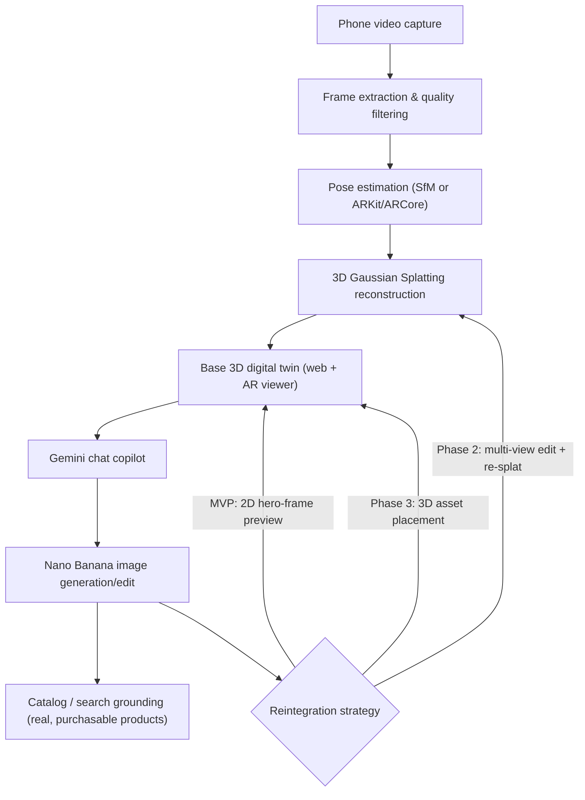

# Master Prompt: AI-Native 3D Capture & Design Platform for Architects and Interior Designers

*Paste everything below into a new conversation with an AI that has extended reasoning and, ideally, web search — e.g., Claude with extended thinking, or Claude Code — to generate the full plan.*

---

## Role & Task

You are acting as a senior product architect and technical co-founder with deep expertise in computer vision and 3D reconstruction (structure-from-motion, NeRF, 3D Gaussian Splatting), applied generative AI (multimodal LLMs and image-editing/diffusion models), AR/XR delivery, and B2B SaaS strategy for the architecture, engineering, and interior design (AEC/ID) industry.

Produce a complete, opinionated product and technical plan for the software described below. This is a planning and architecture exercise — do not write implementation code. Where genuine trade-offs exist, give a concrete recommendation and your reasoning instead of a neutral list of options. Where something is a real open R&D risk rather than settled engineering, say so plainly rather than glossing over it.

## Product Vision

[Product Name] lets architects, interior designers, and their clients film a real physical space on a phone and turns that footage into a photorealistic, walkable 3D digital twin. Inside that twin, a conversational AI copilot built on the Gemini API lets users describe design changes in plain language — "what would this look like with a walnut floor," "show me three sofa options for this corner," "make this feel more Scandinavian" — and generates photoreal visualizations of those changes using Google's Gemini image models (branded "Nano Banana" / "Nano Banana Pro"). The generated change is then reflected back into the 3D scene itself, so the result can be walked through and viewed in AR — not just seen as one flat image.

## Target Users & Core Jobs-to-Be-Done

- **Interior designers** — generate and compare furniture/material options inside a client's *actual* room, not a generic stock render; present options as an immersive walkthrough instead of a static mood board.
- **Architects** — capture existing sites or renovation projects, block out spatial changes, communicate design intent to non-technical clients.
- **Real estate & staging professionals** — an adjacent use case: virtual staging inside a real captured space rather than a stock photo.
- **End clients / homeowners** — a lighter "prosumer" tier: capture a room, get AI-assisted redesign suggestions, see real, purchasable products in context.

## The Core User Journey

1. **Capture** — user films a walkthrough video of a room or space on a phone.
2. **Reconstruct** — the backend extracts frames, estimates camera poses, and builds a navigable 3D reconstruction of the space.
3. **Explore & chat** — user opens the 3D scene and talks to a Gemini-powered assistant about it.
4. **Visualize a change** — user asks for a change (e.g., "put a couch here") or uploads a reference image; Gemini/Nano Banana generates a photoreal edit reflecting it.
5. **Reintegrate** — the edited look is fed back so the *3D scene itself* reflects the change, not just one flat image, so the user can walk around the new version.
6. **Present** — the result is viewable as a walkthrough on the web and in AR/VR at real-world scale, shareable with a client via link.

## Technical Grounding (current as of August 2026 — re-verify before finalizing; this space moves fast)

- **3D Gaussian Splatting (3DGS)** has gone from a 2023 research paper to the dominant technique for turning casual phone video into a photoreal, real-time-navigable 3D reconstruction. The ecosystem is mature: consumer capture apps (Polycam, Luma AI, Niantic Scaniverse, KIRI Engine), open research/production tooling (COLMAP/hloc for pose estimation, Nerfstudio, gsplat), and browser-native viewers (Three.js via the open-source Spark library, PlayCanvas, Cesium 3D Tiles). It's already the standard for "walkable" real-estate tours (Zillow, newer Matterport offerings, and a wave of smaller splat-for-real-estate startups) — close prior art for the capture-and-walk-through half of this product. Traditional photogrammetry meshes and NeRF are both being superseded by 3DGS here, though meshes still matter where precise, editable geometry (CAD/BIM interoperability) matters more than raw photorealism.
- **The generative layer**: Google's Gemini image family, publicly nicknamed "Nano Banana," is the relevant tool for the "show me this couch here" feature. Two active tiers matter: a fast/cheap model (Gemini 2.5/3.1 Flash Image — "Nano Banana" / "Nano Banana 2") suited to rapid exploratory iteration, and a higher-fidelity reasoning model (Gemini 3 Pro Image — "Nano Banana Pro," API model id `gemini-3-pro-image-preview`) suited to client-ready hero renders, supporting 2K/4K output, blending up to ~14 reference images for style/consistency, localized edits (lighting, camera angle, materials), and grounding generations in real-world/search data. This maps directly onto product needs: cheap fast iteration in chat, expensive high-fidelity final renders, and native support for conditioning on a user-supplied reference image or multiple keyframes of the same room.
- **The genuinely hard part of this product is not generation — it's making a 2D generative edit reflect consistently back into a 3D scene.** One edited image of one viewpoint doesn't, by itself, give you a couch you can walk around. Any plan that treats this as a trivial "just re-run the training" step is under-scoping it.
- **Relevant existing building block: World Labs' "Marble" and its World API.** This is close enough to part of what's being described that it has to be evaluated as a build-vs-buy option, not ignored. Marble already takes photos or video of a real space and produces a persistent, spatially-consistent, editable 3D world exportable as Gaussian splats, and its "Chisel" in-scene editor already supports local object replacement, material changes, and lighting edits — with a public World API (launched January 2026) for programmatic access. Decide explicitly whether to build the capture-to-reconstruction-to-in-scene-edit pipeline from scratch, or orchestrate Gemini (chat/intent) and Nano Banana (product-grounded 2D visualization) on top of a backend like this, at least for a first version.
- **The "AI redecorate my room" 2D space is already crowded** (RoomsGPT, Interior AI, ReimagineHome, Spacely AI, Roomagine, MeltFlex, and others), and a few already bolt on a simplified 3D preview or match generated furniture to real, purchasable products. None of the current mainstream players combine full video-based photoreal 3D capture of the *user's actual space* with conversational, reintegrated 3D editing — that combination is this product's real differentiation, and the plan should say so explicitly rather than treating this as uncontested empty space.
- **On "photos or videos" of the space**: keep these distinct. A walkthrough "video" of the result is most credibly produced as a rendered camera path through the real 3D reconstruction (accurate, and how existing splat-based property tours already work), not from a general text/image-to-video generator, which won't reliably preserve the room's true geometry. Google's separate video model, Veo, is reachable through the same Gemini ecosystem and is a reasonable option for stylized marketing clips — but it shouldn't be the mechanism relied on for an accurate "video of my actual room."

## Key Architectural Decisions the Plan Must Resolve

For each, give a concrete recommendation, your reasoning, and what would change your mind.

1. **Reconstruction engine — build vs. buy vs. hybrid.** Self-host an open pipeline (COLMAP/hloc + an open 3DGS trainer) for full control and long-run IP ownership, vs. build on a managed API (World Labs' World API, Luma AI) to ship an MVP in weeks, vs. a staged path from one to the other. Weigh GPU cost, processing latency, and how much control the product needs over the scene representation for editing.
2. **How a generated 2D edit becomes a real 3D change.** Compare at minimum: **(a)** a 2D-only preview on a rendered hero frame — cheap and robust, ships fast, but never becomes walkable; **(b)** edit several keyframes with the same prompt/reference and re-train a new splat from them — closest to what was originally envisioned, but multi-view inconsistency will visibly corrupt the retrained scene unless constrained (e.g., via depth- or segmentation-conditioned edits); **(c)** place a real 3D asset (catalog model, or an image-to-3D generated one) into the reconstructed scene using detected floor/wall geometry, using the image model only to harmonize lighting/color in preview renders. Recommend a default and a fallback, and be explicit that (b) is the riskiest and most likely to need real R&D time.
3. **Capture method.** Plain video upload processed in the cloud (works on any phone, zero install, but interiors are known to fail on blank walls, mirrors, and low light) vs. a dedicated capture app using ARKit/ARCore pose data (and LiDAR on supported devices) for faster, more robust reconstruction. Recommend which to build first.
4. **AR/3D delivery.** Browser-based WebXR (broadest reach, no install, works for both "walk the digital twin" and "place a couch via phone camera in the real room") vs. native ARKit/ARCore apps (better plane detection and occlusion, more engineering) vs. headset support (Vision Pro/Quest) later. Recommend a sequence.
5. **Furniture/material grounding.** Pure hallucination (fast, flexible, but a client can't buy what doesn't exist) vs. grounding in a real product catalog or affiliate feed (via tool-calling/search grounding) so suggestions are things a designer can actually spec and a client can actually buy. Recommend an approach and note the commercial upside of grounding.

## Required Output — Structure the Plan As

1. Executive summary (half a page).
2. System architecture: component list (client layer, ingestion/processing layer, AI orchestration layer, delivery layer, platform layer) with enough description to hand to a diagrammer.
3. Tech stack recommendation, as a table, with a one-line justification per row.
4. Answers to the five decisions above, each with a clear recommendation.
5. Phased roadmap (validation → MVP → differentiation → scale) as a table, with rough timeframes and what ships in each phase.
6. Data privacy, IP, and cost risks specific to this product (client-confidential unbuilt spaces, GPU/inference cost shape, product-image accuracy and trust).
7. Success metrics per phase.
8. Open questions and R&D risks the team should not pretend are already solved.

## Constraints

- Assume a small team (roughly 2–6 engineers) that needs to validate demand before over-investing in custom 3D infrastructure.
- Treat every named product, model, or API as time-sensitive: if web search is available, use it to verify current model names, capabilities, and pricing before finalizing recommendations; otherwise flag them as needing re-verification rather than asserting exact pricing as durable fact.
- Don't propose collecting or processing more user data than the product actually needs — video of people's homes and unreleased client projects is sensitive.
- Use tables for comparisons and the roadmap; keep prose tight; skip generic filler.
- If a section genuinely depends on information you don't have (target launch date, budget, consumer vs. enterprise-first), state the assumption you're making and proceed — don't stop to ask unless it would make the whole plan wrong.
